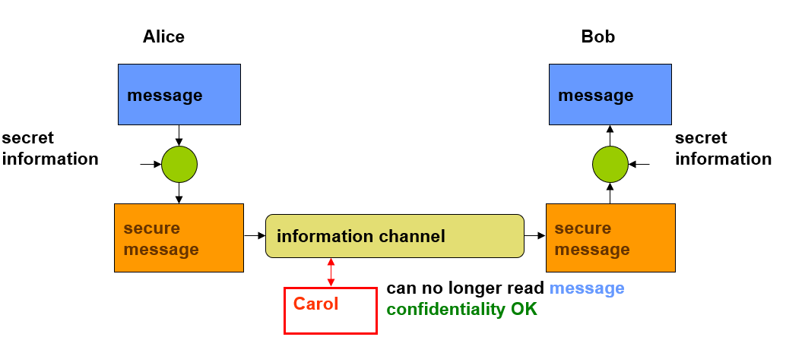
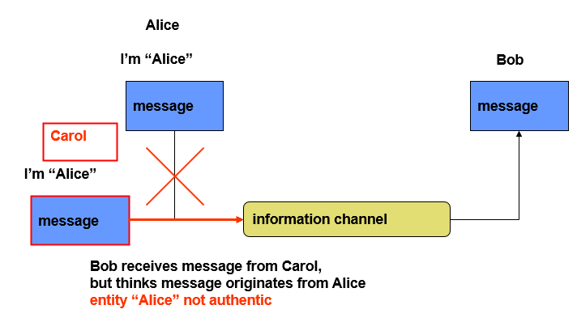
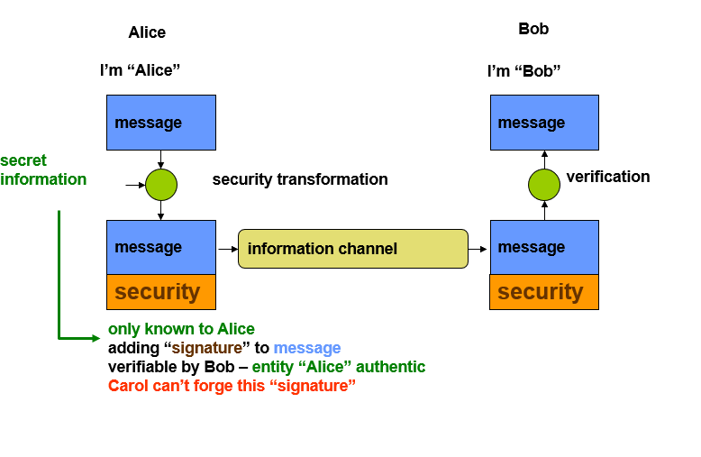
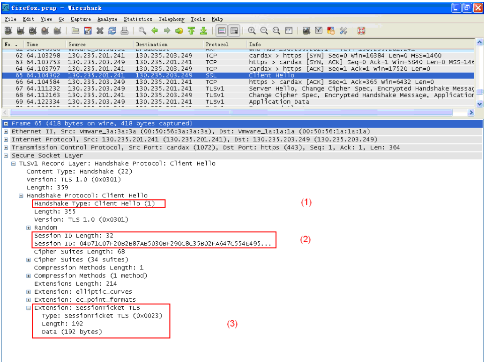

# Beveiliging van netwerken en computers

* 70% schriftelijk examen 
* 30% labosessies

Wanneer men minder dan 8/20 heeft voor minstens één van de onderdelen kan men niet meer slagen voor het geheel van het opleidingsonderdeel.


# -----------Theorie--------------

# Chapter 1: Introduction

Hier worden een aantal voorbeeldjes gegeven van waarom je je systeem goed moet beveiligen en wat er allemaal kan mislopen. Ik ga hier niet verder op ingaan.


# Chapter 2: Basic concepts 

## Confidentiality

Het doel van confidentialiteit is ervoor zorgen dat data enkel kan gelezen worden door zij die **toestemming** hebben om deze te lezen. Enkele voorbeelden waarbij we nood hebben aan confidentialiteit:

* Gevoelige data communiceren tussen verschillende afdelingen van een bedrijf
* Wachtwoorden
* Opslag van gezondheidsdata
* Mijn folder met pikante foto's van je moeder

| Zonder confidentialiteit                                     | Met confidentialiteit                                        |
| ------------------------------------------------------------ | ------------------------------------------------------------ |
|  |  |
| Als Carol meeluistert op het kanaal van Alice en Bob, kan ze horen dat Alice boos is dat Bob de slacentrifuge niet heeft schoongemaakt na gebruik. | Door ons kanaal te encrypteren, kan Carol niet meer meeluisteren. Ze kan het bericht zien passeren, maar kan de gevoelig informatie er niet uithalen. |


### Traffic flow confidentiality

Bij **traffic-flow confidentialty** willen we ervoor zorgen dat het niet mogelijk is om te achterhalen **wie met wie** communiceert. Hiervoor gebruiken we zogezegde **Privacy Enhancing Techniques** (PETs). In het vorige voorbeeld kan zelf bij het introduceren van encryptie, Trudy achterhalen dat Alice en Bob met elkaar praten.


### Privacy

Privacy wordt vaak verward met confidentialiteit, maar niet elke kwestie van confidentialiteit betreft privacy. Privacy heeft meer betrekking tot het privé-leven van een persoon. Zo heeft privacy bijvoorbeeld geen toepassing op intellectueel eigendom van een bedrijf, maar confidentialiteit wel.


## Authentication

We willen zeker weten dat de persoon aan de andere kans is wie hij beweert te zijn. We kunnen de authenticiteit van een communicatie garanderen op basis van:

* **Entity** **authentication**

  * Elke entiteit heeft een unieke identiteit en wordt beschreven door een verzameling data (ID-nummer, email). De authenticatie van de identiteit van een entiteit wordt vaak gebruikt voor entity authentication (dit staat zo in de slides oke ik ga er niet verder op ingaan tis toch niet echt super essentiële info). 

* **Attribute** **authentication**

  * Attributen zijn de karakteristieken van een entiteit, we moeten weten of partijen over de attributen beschikken die ze beweren te hebben, en we kunnen ze dus ook daarmee authenticeren.

* **Data-origin** **authentication**

  * We moeten weten of de data effectief komt van de verwachte bron. Dit is belangrijk om aan te tonen dat de data betrouwbaar is.

  

  | Probleem                                                     | Oplossing                                                    |
  | ------------------------------------------------------------ | ------------------------------------------------------------ |
  |  |  |
  |                                                              |                                                              |

   

## Access control / Authorization

Autorisatie bepaalt welke gebruiker aan data mag komen. Om autorisatie mogelijk te maken, moet de entiteit die aan deze data wilt geauthenticeerd zijn. 


## Data integrity

We willen garanderen dat de verzonden en ontvangen data identiek zijn. Er mag niets toegevoegd, verwijderd, veranderd of herhaald zijn.

Om de eerste drie te voorkomen, kan je een digitale handtekening toevoegen. Om te voorkomen dat een bericht opnieuw verstuurd wordt door een aanvaller, kan je een sequentienummer toevoegen.


## Non-repudiation

Oftewel onweerlegbaarheid, wilt zeggen dat de zender niet kan ontkennen dat hij een bericht heeft verstuurd. Evenmin kan de ontvanger niet ontkennen dat hij het bericht heeft ontvangen.


## Availability

We willen garanderen dat het systeem beschikbaar is voor geautoriseerde en geauthenticeerde gebruikers. Aanvallen zoals DDOS kunnen availability in het gedrang brengen.


## Security threats

We maken een onderscheid tussen:

* Passieve aanvallen
  * Zoals afluisteren of traffic analysis
* Actieve aanvallen
  * Message insertion/modification
  * Impersonatie
  * Replay-aanvallen
  * Denial-of-Service (DoS)
  * Hijacking (als aanvaller een bestaande verbinding overnemen en de plaats van de zender of ontvanger innemen)


Een aantal mogelijke aanvallen op een versleuteld bericht zijn:

* Brute force
  * Alle mogelijke keys uitproberen 
* Cryptanalysis
  * Kennis van de structuur van het algoritme en verbanden tussen plaintext en ciphertext gebruiken om het bericht te ontsleutelen of valse berichten te construeren
* Side-channel attacks
  * Subtielere manier van aanvallen waar we gebruik maken van fysieke eigenschappen (zoals verbruik, rekentijd) of fault injection gebruiken om het bericht of de sleutel te achterhalen.


Categorieën van aanvallen:

* Ciphertext only:
  * De aanvaller kent alleen het versleuteld bericht.
* Known plaintext:
  * We beschikken buiten het versleuteld bericht ook over enkele versleutelde berichten waarvoor het originele bericht bekend is.
* Chosen plaintext:
  * We beschikken over een bericht en zijn versleutelde versie, maar wij hebben de versleutelde versie gekozen. Het kan dus dat het bericht gewoon jibberish is.
* Chosen text
  * Hetzelfde, maar nu hebben wij het onversleutelde bericht gekozen

## Test jezelf

>  Explain the difference between confidentiality, authentication, access control / authorization, data integrity, non-repudiation and availability


> Which of the above security goals are realized in the network protocols from Chapter 4?


> Why are sequence numbers (or nonces) added to messages? Is it a good idea to use a time stamp for
> this purpose?

This is to ensure that the message is unique and it hasn't been replayed or tampered with. Using a timestamp is not an excellent idea, because an attacker could guess the timestamp if the sender and receiver are not perfectly synchronized. A low precision in the timestamp could make this even easier.


> Which counter measurements can be taken against DoS and DDoS attacks?

1. Firewalls and intrusion prevention systems (IPS): Firewalls and IPSs can help to detect and prevent malicious traffic from reaching the target server. These systems can be configured to block traffic from known attack sources, or to filter out traffic that exhibits certain characteristics that are common to DoS attacks. 
2. Bandwidth limiting: Another way to mitigate DoS attacks is to implement bandwidth limiting on the server or network. This can help to prevent the server from being overwhelmed by too much traffic, and can help to ensure that legitimate traffic is able to reach the server.
3. Load balancing: Load balancing can help to distribute the load across multiple servers, making it more difficult for a single DoS attack to bring down the entire system.


> Give 5 examples of active attacks that can be used to compromise the security of a network protocol.

* Message insertion/modification
* Impersonation
* Replay-attacks
* Denial-of-Service attacks
* Hijacking


# Chapter 3: Encryption algorithms

## Steganography

Het doel van **steganografie **is een bericht te verbergen door het in andere data te verstoppen. In tegenstelling tot cryptografie gaan we hier ook het effectieve bestaan van het bericht proberen te verbergen. Zo kan je bijvoorbeeld een tekst in de binaire code van een afbeelding proberen te verstoppen. Een praktische toepassing hiervan is **watermarking**, hier gaan we een verborgen markering toevoegen aan een bestand, waardoor we bijvoorbeeld gecrackte software kunnen opsporen. Elon Musk heeft dit [ook gedaan](https://theintercept.com/2022/12/15/elon-musk-leaks-twitter/) om op te sporen wie gevoelige emails had geleakt. 


## Encryption throughout history

### Substitution cyphers

Bij een substitution cypher gaan we elke letter in onze tekst vervangen door een bepaalde andere letter. We maken onderscheid tussen enkele verschillende soorten.

* Monoalphabetic
  * Caesar cypher: elke letter vervangen door een letten X aantal plaatsen verder in het alphabet. Hier zijn maar 26 mogelijkheiden.
  * Generic substitution cipher: elke letter mappen op een andere letter, niet in een bepaalde volgorde. Nu zijn er 26! mogelijkheden.
  * Al deze ciphers zijn makkelijk te kraken met frequentieanalyse
* Polyalphabetic
  * Alberti cypher: een encryptieschijf om een bepaald aantal letters verder roteren
  * Vigenère cipher: een sleutel bestaat uit meerdere letters deze geven elk aan welk alfabet je moet gebruiken
* Digraph
  * Playfair cipher: maak een matrix van letters gebaseerd op een sleutelwoord en vul de rest van de matrix met de rest van de letters van het alphabet. //TODO misschien uitleggen hoe het werkt als ik tijd en zin heb

### Transposition cyphers

Hier veranderen we de volgorde van de letters om een versleuteld bericht te bekomen. 

* Rail Fence cipher
  * Schrijf de letters in een zigzag over drie rijen en lees rij per rij.
* Columnar Transposition Cipher
  * Verdeel het bericht in kolommen en schud deze door elkaar aan de hand van een sleutel.

### Combination ciphers

Dit is simpelweg meerdere ciphers achter elkaar zetten om het weer moeilijker te maken. Grappig genoeg ligt dit aan de basis van de meeste moderne encryptiealgoritmes.


## Modern cryptography

### Symmetric encryption algorithms

Dit plaatje beschrijft mooi wat symmetrische encryptiealgoritmes wensen te bereiken.


Hiermee kunnen we twee doelen bereiken:

* Confidentialiteit:
  * Gevoelige gegevens veilig opslaan 
  * Gevoelige gegevens veilig doorsturen
* Authenticatie
  * Als Alice en Bob een gedeelde geheime sleutel hebben, weet Alice zeker dat ze met Bob praat. Dit is eigenlijk niet zo een goede oplossing, want Alice moet alle sleutels van iedereen waarmee ze wilt praten hebben. We zijn eigenlijk ook niet 100% zeker waar het bericht vandaan komt.


#### Block ciphers vs. stream ciphers

Bij een block cipher encrypteren we het bericht in grotere **blokken** (typisch 8 tot 128 bytes). We moeten dan mogelijks padding toevoegen om het bericht aan te lengen zodat het overeenkomt met de blokgrootte.

Bij een stream cipher encrypteren we **bit per bit** (of byte per byte).


#### Feistel encryption scheme

Het Feistel schema is een cryptografisch algoritme waarbij de input wordt geëncrypteerd in meerdere *rounds*. Veel moderne encryptiealgoritmes gebruiken dit schema. Eén round bestaat uit de volgende stappen:

1. Divide the input data into two halves, L and R.
2. Apply a round function F to the right half (R) and the subkey $K_i$.
3. XOR the result of the round function with the left half (L).
4. Swap the modified left half (L) with the right half (R).


| Encrypteren                                                  | Decrypteren                                                  |
| ------------------------------------------------------------ | ------------------------------------------------------------ |
|  |  |

* Met linkerhelft $L$ en rechterhelft $R$
* $F$: een round-function (dus een onbepaalde cryptografische functie)
* $\oplus$: bitwise XOR
* $K_n$: de $n$-de sleutel.  

Het principe van het Feistel Schema is gebaseerd op het combineren van *confusion* en *diffusion* functies, met als doel om de statistische eigenschappen van de plaintext niet door te laten komen in de ciphertext.

* **Diffusion**: Het veranderen van één karakter in de input heeft een invloed op meerdere karakters van de output. Dit kan je bereiken door middel van een combinatie van permutaties en transformaties.

  * Dit wordt bij Feistel bereikt met het wisselen van $L$ en $R$

* **Confusion**: De relatie tussen statistische eigenschappen van plain- en ciphertext zo complex mogelijk maken. Dit kan je bereiken met complexe substitutieschema's.

  * Met de $F$, $K$ en XOR in Feistel.

  

De effectieve implementatie van een Feistel-netwerk hang af van een aantal parameters en designelementen:

* **block size** - increasing size improves security, but slows cipher 
* **key size** - increasing size improves security, makes exhaustive key searching harder, but may slow down the cipher 
* **number of rounds** - increasing number improves security, but slows cipher 
* **subkey generation** algorithm - greater complexity can make analysis harder, but slows cipher 
* **round function** - greater complexity can make analysis harder, but slows cipher 
* **fast software /decryption -** more recent concern for practical use 
* **ease of analysis** - for easier validation & testing of strength


#### DES & 3DES

DES volgt het Feistel schema. Belangrijk om te weten is dat dit algoritme de dag van vandaag niet meer veilig is. 

//TODO uitleg voor DES als we die moeten kennen.


#### Block cipher modes

Er zijn verschillende manieren om een block cipher toe te passen:

* **ECB** **(Electronic** **CodeBook**)
* **CBC** **(Cipher Block Chaining)**
* **CFB** **(Cipher FeedBack)**
* **OFB** **(Output** **FeedBack**)
* **CTR** **(CounTeR)**


##### ECB: Electronic code book

Dit is de simpelste *mode*. We encrypteren elke block van de ciphertext onafhankelijk. Dit is natuurlijk niet optimaal, want je kan nog best info achterhalen, omdat elk blok op dezelfde manier is geëncrypteerd. Het is wel een stuk efficiënter om toe te passen op geparallelliseerde hardware. Je kan het opzich wel gebruiken voor korte berichten.

##### CBC: Cipher block chaining

We gaan eerst elk blok dat we willen encrypteren **XOR'en** met het **vorige blok**. Het eerste blok wordt ge-XOR'ed met een random gegenereerde **initialisatievector** (IV) van dezelfde grootte als het blok. Deze vector wordt dan ook nog toegevoegd aan het geëncrypteerde bericht, anders kan de ontvanger het niet ontsleutelen.

Als een aanvaller de IV op de één of andere manier kan voorspellen, is de aanval niet bestand tegen chosen-plaintext aanvallen.

Eén probleem met CBC is dat als je een bit-error hebt in één plaintext blok, deze fout wordt overgedragen naar alle volgende blokken en is het mogelijks onmogelijk om het bericht te decrypteren. Als er een fout zit in een geëncrypteerd blok, zullen er maar twee plaintext blokken een fout bevatten. 

Volgens de slides is CBC ook bruikbaar voor authenticatie.

#### CFB: Cipher Feedback


#### OFB: Output Feedback


#### CTR: Counter


### Test jezelf

> Try to encrypt and decrypt a self-defined message using the provided encryption approaches


> What are block cipher modes? What are the advantages and disadvantages of the modes described in the course?


> How secure is 3-DES? Explain why.


> What does ECDHE_RSA stand for? For which purpose are these different algorithms used?


> Why is AES or DES not typically used as a hash function?


> What are the strong and weak collision requirements?


> Give an example scenario describing why these are relevant.


> What is the main difference between a digital signature and a MAC?

# Chapter 4: Network and communication security

True or false: the SSH transport layer protocol encrypts TCP packets. Explain.

Explain the functions of the SSH transport layer protocol, SSH user authentication protocol and SSH connection protocol

In which scenarios does it make sense to do a SSH key re-exchange? Why?

What is the difference between a SSH session and a SSH channel? Which channels are supported?

Which port number does SSH typically listen to?

Explain the difference between local and remote port forwarding.


Explain the benefits of ephemeral DH over traditional DH.

What is the difference between a Key Distribution Centre (KDC) and Public Key Infrastructure (PKI)?

What are the advantages / disadvantages of both approaches?

List 5 reasons why a certificate might have to be revoked. How can this revocation be implemented?

Give example restrictions that can be part of a certificate. Why are these relevant?


What are the main differences between TLS and SSH?

TLS encrypted packets are authenticated when they are transmitted. Does this authentication mechanism use a shared secret key, or a private key? Why?

Is TLS vulnerable to traffic pattern analysis attacks? Why (not)?

Is the TLS record header included in each transmitted TCP packet?

For which applications / use cases would you prefer SSH over TLS (and vice versa)? Why?


Give 5 examples of security problems that can be solved by IPsec but not by TLS or SSH

Which of the following security services can be achieved with IPsec: access control, integrity, authentication, confidentiality (which types)?

Which IPsec protocols provide traffic flow confidentiality? Why is this only a limited form of confidentiality?

# Chapter 5: Software and systems security

True or false: to generate an S/MIME session key, first a key exchange algorithm is invoked

What is the purpose of degenerate signedData messages in S/MIME?

Explain the workings of cross-site scripting. How can one defend against this type of attack?

Explain the differences between XSS and CSRF


What are the advantages and disadvantages of increasing the length of hash chains / rainbow tables?

Explain the major differences between hash chains and rainbow tables.

What is 2-factor authentication?

What are the security advantages of using security tokens vs software based approaches?

Which are the advantages of using full disk encryption vs manual encryption?

# Chapter 6: Intrusion detection


# Chapter 7: Future trends


# Voorbeeldvragen

## Gesloten boek

> Wat is “perfect forward security”.

* Leg uit.
* Waarom is dit belangrijk voor cryptografische systemen?
* Hoe wordt dit in IPsec geimplementeerd?


> Beschrijf 5 strategieen die door virussen gebruikt worden om zich te verbergen voor anti-virus software (“e.g. stealth strategies”)


> Waar of vals? Waarom?

> Indien de file met paswoorden verworven wordt door een aanvaller kan deze de gevonden hashes rechtstreeks gebruiken om in te loggen op een systeem.


## Open boek

> Waarom vermeldt het SSH protocol de gebruikte softwareversie in de uitgewisselde pakketten tijdens het negotiatiealgoritme?


> Wanneer men een file eerst DES encrypteert en daarna decrypteert met dezelfde sleutel bekomt men terug het oorspronkelijk bestand. Is dit ook het geval wanneer men de omgekeerde volgorde uitvoert, dus eerst decryptie en dan encryptie? Waarom?


> De wireshark trace van een security protocol wordt weergegeven.

> * Welk protocol werd gecaptured?
> * Leg uit wat er gebeurt in packet 65.




# -----------Labo-------------


## Veelgemaakte fouten ssh


* Server zegt nee omdat de verkeerde key wordt aangeboden


* Je mag niet aan de map
* sudo zal niks uithalen, want je krijgt meer rechten op de lokale machine
* Kopieer eerst het bestand van de lokale machine naar een map waar je wel rechten op hebt, ssh naar de server en voer sudo cp om het bestand dan op de juiste plaats op de remote te zetten


* Gebruiker heeft geen toegang tot het bestand op de lokale machine
* Hier werkt sudo wel
* Je kan wel weer een public key permission denied krijgen omdat hij de default keys van de root gebruiker zal gebruiken voor ssh


### Permission denied (public key)

Check 3 dingen:

* Zit ik op de juiste user?
* Gebruikt de client de juiste key?
  * default ~/.ssh/id_\*
* Heeft de server de juiste key voor de juiste user?


### SSH naar private VM zonder routing

​	

In dit scenario is er geen routing van de client naar de nieuwe VM

```bash
ssh -NT -L 8888:192.168.64.2:22 student@192.168.132.1
#			|				|			|
#			|				|			|
#			Lokale poort	|		Login van gateway
#							|
#							Poort van nieuwe VM
# NT -> gewone portforwarding, geen shell

ssh -p 8888 student@localhost
```


* Het bovenste moet je doen op de gateway
* Het tweede doet remote port-forwarding
  * Al het verkeer dat wordt gestuurd naar een bepaalde poort van de remote server, wordt doorgestuurd over de ssh tunnel naar de lokale server, waarna het doorgestuurd wordt naar het IP adres dat we aangeven.


## SSL

Voorziet security bovenop de transportlaag, poort 443

X.509 certificaten