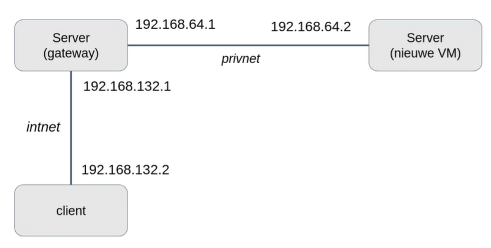
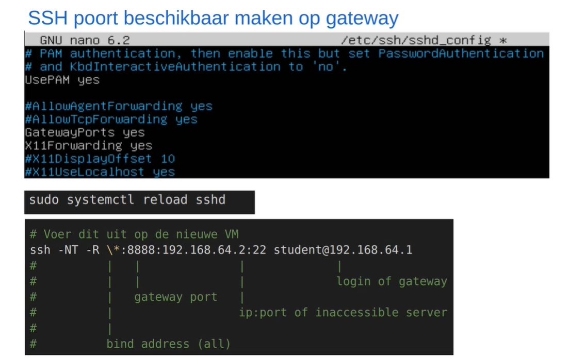

# Beveiliging van netwerken en computers

* 70% schriftelijk examen 
* 30% labosessies

Wanneer men minder dan 8/20 heeft voor minstens één van de onderdelen kan men niet meer slagen voor het geheel van het opleidingsonderdeel.


# Labo


## Veelgemaakte fouten ssh


* Server zegt nee omdat de verkeerde key wordt aangeboden


* Je mag niet aan de map
* sudo zal niks uithalen, want je krijgt meer rechten op de lokale machine
* Kopieer eerst het bestand van de lokale machine naar een map waar je wel rechten op hebt, ssh naar de server en voer sudo cp om het bestand dan op de juiste plaats op de remote te zetten


* Gebruiker heeft geen toegang tot het bestand op de lokale machine
* Hier werkt sudo wel
* Je kan wel weer een public key permission denied krijgen omdat hij de default keys van de root gebruiker zal gebruiken voor ssh


### Permission denied (public key)

Check 3 dingen:

* Zit ik op de juiste user?
* Gebruikt de client de juiste key?
  * default ~/.ssh/id_\*
* Heeft de server de juiste key voor de juiste user?


### SSH naar private VM zonder routing

​	

In dit scenario is er geen routing van de client naar de nieuwe VM

```bash
ssh -NT -L 8888:192.168.64.2:22 student@192.168.132.1
#			|				|			|
#			|				|			|
#			Lokale poort	|		Login van gateway
#							|
#							Poort van nieuwe VM
# NT -> gewone portforwarding, geen shell

ssh -p 8888 student@localhost
```




* Het bovenste moet je doen op de gateway
* Het tweede doet remote port-forwarding
  * Al het verkeer dat wordt gestuurd naar een bepaalde poort van de remote server, wordt doorgestuurd over de ssh tunnel naar de lokale server, waarna het doorgestuurd wordt naar het IP adres dat we aangeven.