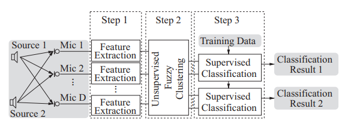
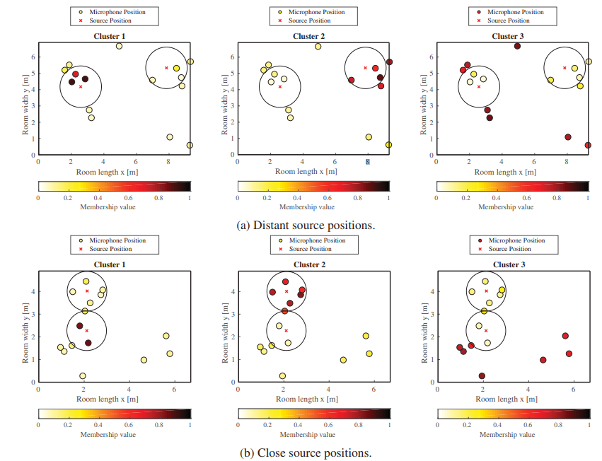

# Literature study

* Initial Papers

- [x] Classification of reverberant audio signals using clustered ad hoc distributed microphones
- [x] Estimating Source Dominated Microphone Clusters in Ad-Hoc Microphone Arrays by Fuzzy Clustering in the Feature Space
- [x] Source separation by fuzzy-membership value aware beamforming and masking in ad hoc arrays
- [x] SOURCE SEPARATION BY FEATURE-BASED CLUSTERING OF MICROPHONES IN AD HOC ARRAYS
- [ ] Madhu phd thesis

* Extra papers

- [x] 2D Acoustic Source Localisation Using Decentralised Deep Neural Networks on Distributed Microphone Arrays
- [ ] A Coherence-based Clustering Method for Multichannel Speech Enhancement in Wireless Acoustic Sensor Networks
- [ ] ESTIMATION OF MICROPHONE CLUSTERS IN ACOUSTIC SENSOR NETWORKS USING UNSUPERVISED FEDERATED LEARNING
- [ ] Exploiting Temporal Context in CNN Based Multisource DOA Estimation
- [ ] Unsupervised Clustered Federated Learning in Complex Multi-source Acoustic Environments
- [ ] Neural_Networks_Using_Full-Band_and_Subband_Spatial_Features_for_Mask_Based_Source_Separation (cant open this file)

* Under review

- [ ] EXPLOITING SPEAKER EMBEDDINGS FOR IMPROVED MICROPHONE CLUSTERING AND SPEECH SEPARATION IN AD-HOC MICROPHONE ARRAYS

## Questions

* Q: Mel-frequency cepstrum?
  * eerst naar fourier domein
  * 

* 

## Classification of reverberant audio signals using clustered ad hoc distributed microphones

This paper proposes an algorithm to provide a way of clustering ad hoc distributed microphones so that they can be divided in:

* Microphones where one of the sound sources is dominant
* Microphones containing mainly signal mixtures and reverb

Audio feature extraction is performed directly in each device of the WASN. The captured data is represented in a feature vector compactly, so there is no need to exchange audio signals.

We need a strategy to create compatibility between test and train data, while also exploiting the spatial distribution of the receivers. This can be done in three different domains:

* Signal domain
  * We don't know much about the receiver positions so strategies like beamforming are quite useless
  
* Feature domain
  * Combine-then-analyse (CTA)
  
  * The feature vectors are combined, after which they are used as a common test sample in the classification system
  
    
  
* Decision domain
  * Analyse-then-combine (ATC)
  
  * Here we classify the feature vectors from different devices independently, after which they are combined to result in one classification decision.
  
    

**Proposed algorithm**

The authors have opted to use the CTA strategy for this problem, as this allows the microphones to be clustered with a fuzzy-clustering procedure. This way, microphones can be divided into groups dominated by one type of audio signal. Devices that receive a more balanced mixture of source signals will receive an intermediate cluster value. 

After clustering, a combination strategy is applied, whereafter the signal classification can be performed.

* Signal feature extraction
  * Audio data is transformed into a parametric representation, which allows distinction between classes while reducing the amount of data.
  * Mod-MFCCs features are computed //TODO
  *  Cepstral mean normalization is performed on the result to reduce reverberation
* Unsupervised signal clustering
  * The resulting features from the previous step are clustered using the Fuzzy c-means algorithm. 
  * Each microphone will receive a value for each cluster in the range $[0,1]$ 
  * This value indicates its membership in each of the $N$ clusters
  * There are $N-1$ microphones, so one extra cluster is added for microphones where background noise or reverberation is dominant. 
* Feature vector combination
  * The feature vectors from the different microphones are combined, using weights acquired from the previous step
  * This way, microphones that pick up the source signal better will contribute more to the classification
  * The combined information is used to perform a cluster related classification

**Conclusion**

This method outperforms classification based on a single microphone for each cluster. The algorithm works very well for distinguishing between speech and music. 

## Estimating Source Dominated Microphone Clusters in Ad-Hoc Microphone Arrays by Fuzzy Clustering in the Feature Space

This paper proposes to cluster microphones in an ad-hoc microphone array by source, adding one cluster for noise. Audio features, extracted from the microphone signals are used for fuzzy clustering, after which their fussy membership value is used to assign them to either a source dominant or a background cluster.

**Fuzzy clustering**

Instead of hard clustering the microphones. We'll use fuzzy clustering. This means that each microphone won't be perfectly in one cluster, but rather get a Fuzzy Membership Value (FMV) that indicates how much a microphone belongs in a certain cluster. The microphone is then assigned to the cluster for which it has the highest FMV.

**Evaluation**

Two simulated setups were used, one where two sources were placed randomly, but each in one half of the room. In the second setup, the sources were put closer together.

Research was also conducted in an acoustic laboratory using 16 microphones and two sound sources. The sources were either music or a male and female speaker. 100 different combinations were used. 

**Results**

For all scenarios, the background cluster is detected correctly in at least 89.7% of the cases for the scenario with speech and music sources and in over 93% of the cases with a male and a female speech source. This method seems to work very well with two sound sources, but no research was done with more sources. 

## Source separation by fuzzy-membership value aware beamforming and masking in ad hoc arrays

Q: What does an impulse response from a source to a microphone mean?

**1. Introduction**

This paper focuses on audio signal enhancement with delay-and-sum beamforming and extends upon the previous paper's fuzzy clustering.  For each source cluster, relative time-differences-of-arrival (TDOA) are estimated. This is combined with the FMV in the beamforming stage.

In a second enhancement stage, cluster-related spectral masks are applied to the output of the beamformers.

Q: Cepstral mean normalization? -> minder reverberaties door gemiddelde ervan af te trekken

**2. Ad hoc clustering**

A FMV is calculated for each microphone and for any source, a subset of the microphones will be selected for further processing. In essence, we're selecting the most useful microphones for processing the sound from each source.

**3. FMV-aware signal enhancement**

In each cluster, a reference microphone is selected. Subsequently, a correlation analysis of all the other microphone signals in respect to the reference signal is performed. This allows for an estimation of the TDOAs, which can be used in the beamforming stage. 

**3.1 Initial source signal estimation**

As I understand it, this mask just indicates in which microphone the source signal is dominant.

Q: Is this correct?

Q: What is $B$ in the mask?

**3.2 Time-difference-of-arrival estimation**

Now the TDOAs are estimated with correlation analysis. This is realised as a time-domain cross-correlation, computed over segments of ∼ 4s in length, which is also the duration across which the audio features for the fuzzy clustering are computed. 

**3.3 Clustering-steered beamforming**
$$
\hat{s}_{n \text{, W-DSB}}(l) = \sum_{i_n}w_{n,i_n}x_{i_n}(l + D_{i_n})
$$

* $\hat{s}_{n \text{, W-DSB}}(l) $: Q: what exactly does this mean?
  * $l$ is the discrete time index
* $D_{i_n}$: relative TDOA's
* $w_{i_n}$: the weights allocated to each microphone $i_n$ of cluster $n$
  * These are proportional to the FMV

By using a weighted combination of the microphone signals, we can make a better DSB.

**3.4 Mask re-estimation for post-filtering**

The result of the previous stage should give an enhanced signal, which can now be used to compute a post-filtering mask.

Q: I don't understand very well how this mask is calculated.

This mask is then applied to the the signal, which was already processed by the fuzzy-membership value aware beamforming. 

This yields a final source signal estimate. 

The image below shows a schematic of the full algorithm.

Q: Wat gebeurt er precies bij de feature extraction?

**4. Evaluation**

This was very similar to the previous paper.

FMVA-DSB consistently yields a better performance compared to the simple DSB. However, the performance difference is not very large. 

## Source separation by feature-based clustering of microphones in ad-hoc arrays

Here, the simple DSB is done on the microphone signals, without taking into account the FMVs. 

Q: Why do they use fuzzy clustering here? Because they're only using the FMV to determine in which cluster a microphone should end up.

## 2D Acoustic Source Localisation Using Decentralised Deep Neural Networks on Distributed Microphone Arrays

In this paper, a method to estimate the direction of arrival in a microphone using neural networks is proposed. By sharing a part of the neural network between the different microphone arrays, we should be able to achieve higher accuracy.

With one microphone array, is is only possible to find an estimate for the DOA. If we use multiple microphone arrays, a wireless acoustic sensor network (WASN), it is also possible to localize the source signal in 2D space by combining the data from the arrays. In this paper, they use two microphone arrays.

Typically, the different nodes are only weakly synchronized. The solution should be able to deal with that. 

The paper describes three approaches to the problem:

**Triangular approach**

This approach is used as a reference

The grey bands show that the weights on each level are identical. Two microphones are used to gain a DoA estimate for both microphones. The processing is done separately on each microphone array, after which the DoA for each array is sent to a central processing hub. Here, the intersection of the two DoA's is calculated using triangulation, which results in an estimated position of the target speaker in 2D space.

**Narrowband mixing CLA (NM-CLA)**

The information of the different microphone arrays is combined right after the last convolutional layer of both arrays, after which an inter-array convolution is performed. The method is called narrowband, because the frequency information is still present at this time.

The output is defined as a classification problem, where each class represents a rectangle in 2D space. The output of the DNN represents the probability of the speaker being present in each region.

This approach uses more bandwidth, as $64 \cdot K$ (where $K$ is the amount of frequency bins) features have to be transmitted to the central node by each array.

**Broadband mixing CLA (BM-CLA)**

This method has lower bandwidth requirements. The convolutional layers are joined together after they are flattened and go through a fully connected layer. This layer already combines the frequency bins, hence the name broadband. 

This way, only 512 features have to be sent to the central unit.

Both methods don't add a crazy amount of parameters in comparison to the triangulation method, since they only add one convolutional layer.

**Conclusion**

BM-CLA has the best accuracy, and a lower bandwidth requirement. Both methods are robust against small deviations in clock synchronicity, because the features between nodes are only mixed at deeper stages of the DNN. 

## Estimation of microphone clusters in acoustic sensor networks using unsupervised federated learning

## Notes

cluster 4

project ghent

adhoc thesis jupyterlabs

