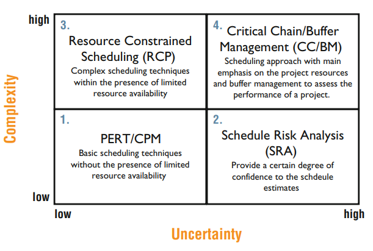
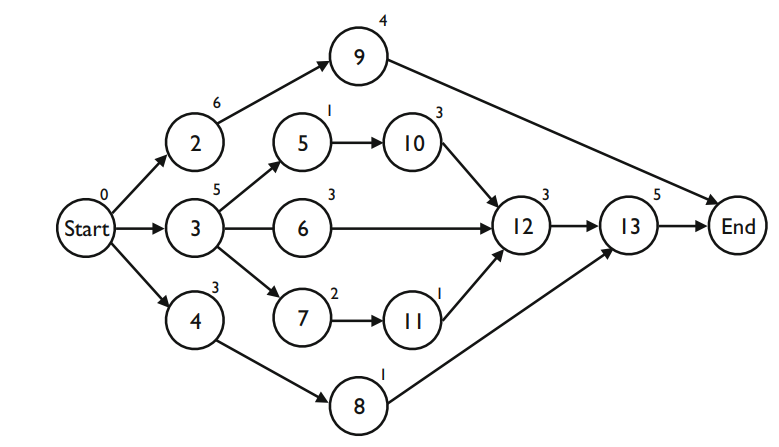
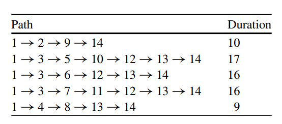
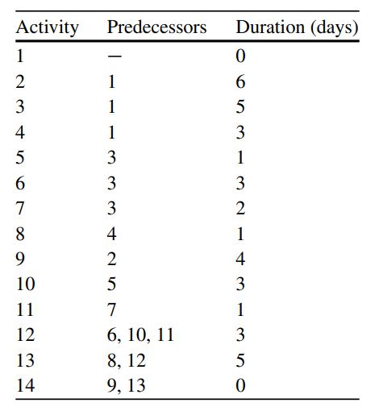
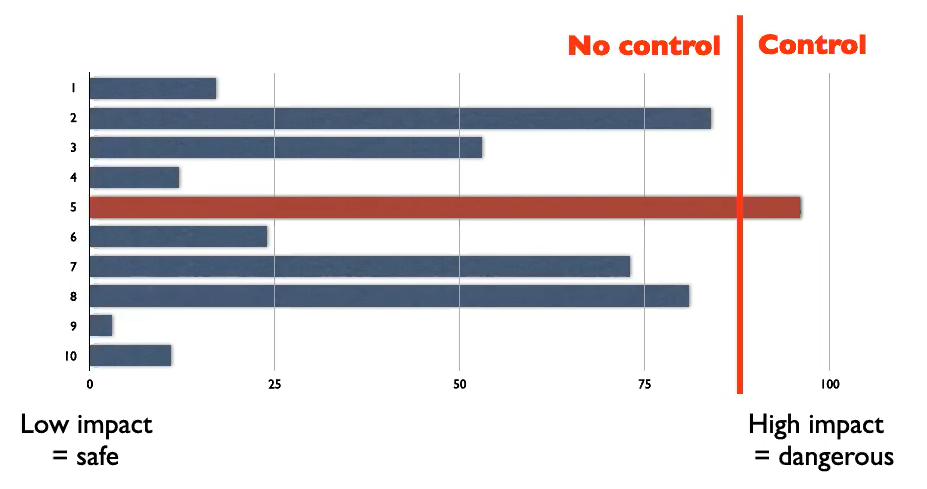
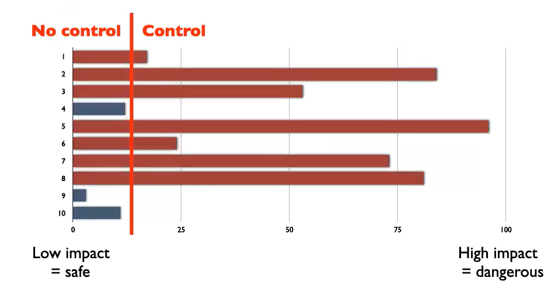
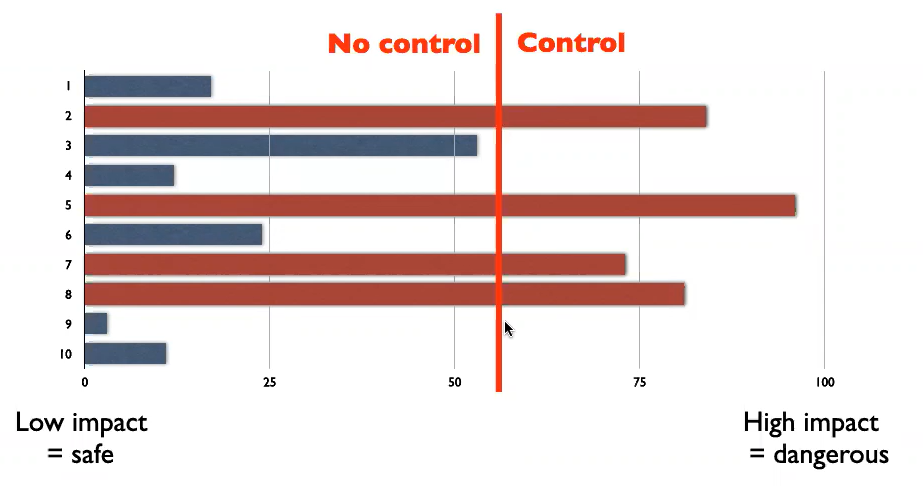
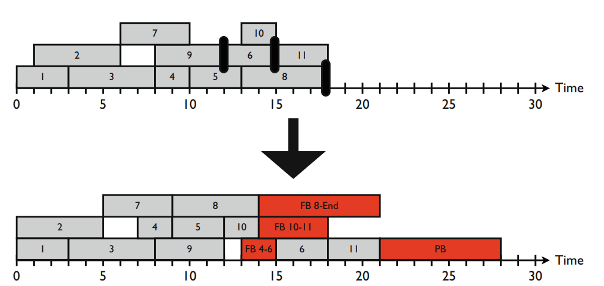

# Project management

* 50% group assignment
* 50% exam

# Exam

* No theoretical questions
* 5-6 exercises
* A question about everything
  * Each question has subparts of increasing difficulty
* Possible questions
  * PERT
  * The game
    * Crashing
  * Schedule risk analysis
    * In which direction will the numbers go?
  * Resources (CC)
    * Priority rules 
    * Leveling
    * Work continuity
    * 5th new objective
  * CCBM
    * sizing
  * EVM 
    * Practice using the excel file


# Lectures

## 1 - Introduction

### Project life cycle


* <u>Concept phase</u>: organization identifies the need for a project or receives a request from a customer
* <u>Definition phase</u>: organization defines project objectives, specifications and requirements. These objectives need to be translated to a list of **activities** (a set of technological precedence relations and the resource availabilities and requirements)
* <u>Scheduling phase</u>: construction of a timetable for project activities, a start and finish time for each activity respecting precedence relations
* <u>Execution and control phases</u>: the project is monitored and controlled to see whether it is performed according to the existing schedule. So corrective action needs to be taken when deviations occur. This is done with a **feedback loop** between the control and scheduling phases.
* <u>Termination phase</u>: completion and critical evaluation of the project. This is useful for future projects.


### Project mapping

Our good friend Mario suggests mapping projects on two dimensions:

* <u>Complexity</u>: How complex is the project
* <u>Uncertainty</u>: How much uncertainty is there in the project, for instance unexpected changes

This allows us to put the project scheduling techniques in one of the four quadrants. It is important to use a technique only if the underlying assumptions and corresponding advantages/disadvantages are thoroughly known and understood



| Uncertainty/complexity | Low  | High |
| ---------------------- | ---- | ---- |
| **High**               |      |      |
| **Low**                |      |      |

//TODO voorbeeldjes

## 2 - Project network analysis

### WBS and OBS


By making a **Work Breakdown Structure** (WBS), you break down the major project deliverables in smaller, more manageable components. It helps organize and define the total work scope of a project, and can be represented as a hierarchical structure.

* <u>Project objective</u>: a short description of the scope of the project. A careful scope definition is of crucial importance in project management. 
* <u>Work item</u>: The project is broken down into manageable pieces (items) to be able to cope with the project complexity. 
* <u>Work package</u>: The monitoring and collection of cost data often occurs at this level. 
* <u>Activity</u>: The lowest level of the WBS, where the accuracy of cost, duration and resource estimates can be improved, and where the precedence relations can be incorporated.

It is often used together with the **Organizational Breakdown Structure (OBS)** to create a Responsibility Assignment Matrix (RAM). 


### Network analysis

The work packages from the WBS need to be further subdivided in activities. Many activities involve a logical sequence during execution. The links between them are called **technological precedence relations**. This results in a network of activities which can be represented as a graph. There are two ways in which this can be done:

* Activity-on-the-node (AoN) 
* Activity-on-the-arc (AoA) 


#### Activity-on-the-arc (AoA) 

This means that activities are represented by arcs in our graph. We'll first consider an example set of activities:


These can be represented in an AoA model like so:


Note the dashed lines, these are **dummy activities**. They are often necessary if you want to create an AoA graph that respects all precedence relations. They are called dummy activities because you are a dummy if you use AoA. An AoA network is not unique, so multiple solutions are possible.

#### Activity-on-the-Node (AoN)

Ahh, activity-on-the node, the vastly superior graph representation for activities. Activities are denoted by nodes, which makes much more sense. Precedence relations are represented by arcs. This network type is usually simpler and doesn't require dummy activities apart from one fictional start and one end activity. An AoN network is **always unique**.

The example from before then looks like this (better):


Because this might be an interesting exam question, here is a pros and cons list of both methods.

| Activity-on-the-Arc                 | Activity-on-the-Node                  |
| ----------------------------------- | ------------------------------------- |
| - Dummy activities                  | + No dummy activities                 |
| - Limited software support          | + Better software support             |
| + Easier to understand project flow | - Harder to follow for large projects |
| - Multiple representations          | + Unique representation               |
| - Difficult rules                   | + No difficult rules                  |


### Precedence relations

Before, all precedence relations were implicitly assumed to be Finish-Start. You can extend them in three ways:

* <u>Time-lag</u>: zero or nonzero. 
* <u>Type</u>: finish-start, finish-finish, start-start and start-finish. •
* <u>Time-lag requirement</u>: minimal or maximal.

**Time-lag** simply tells how long you have to wait before you can start the next activity. For example, if you pour concrete, you can't start building a house on it the next day. There are four **types** of precedence relations, illustrated below:

* <u>Finish-Start</u>: next activity can start after finishing the previous
* <u>Start-Start</u>: next activity can start after starting the previous
* <u>Finish-Finish</u>: next activity can finish after finishing the previous
* <u>Start-Finish</u>: next activity can only finish after starting the previous

Time-lag can also be incorporated in all of these types. But I think your imagination is good enough to imagine how that would work.


The **time-lag requirement** can be maximal or minimal. In the previous it was always assumed to be minimal. The maximal time-lag means that the next activity had to start before the amount of time-lag. If your mama cooks you a nice spaghetti, you also have to eat it before it gets cold. 


### Other constraint types

//TODO is dit belangrijk?


### Critical path

When drawing a network of a project, you can draw paths through that network from start to finish. The longest path you can find here is the **critical path**. The length of this path determines the **overall project duration**. Any delay on the critical path results in a delay in the project.

|  |  |  |
| ------------------------------------------------------------ | ------------------------------------------------------------ | ------------------------------------------------------------ |

For very large projects, it isn't feasible to calculate the length of the critical path by just trying out all possible paths. So software tools **calculate the critical path** as follows:

1. Calculate the **earliest start schedule** (ESS)
   * To calculate the ESS, start from the first activity and, respecting precedence relations, go through the network and write down the earliest moment each activity can start. Now you know the minimal duration of the project.
2. Calculate the **latest start schedule** (LSS)
   * The LSS is the opposite, you start from the last activity and count back from the project deadline (the minimal duration from the previous step). Write down the latest moment every activity can start.
3. Calculate the **slack** for each activity
   * For one activity, the slack is the **difference** between the **latest start** and the **earliest start** (or latest finish and earliest finish, it's the same)

All activities on the critical path will have **zero slack**.


As an exercise, you can try to calculate the critical path for the example using this method. Here is the solution:


### Gantt charts

A Gantt chart displays a timetable containing every activity from a project. 


The critical path is marked in red and the grey lines represent activity slack. One thing to keep in mind is due to the different precedence relations we've discussed, a duration increase on a critical activity doesn't necessarily mean an increase in project duration. 


### PERT

The Program Evaluation and Review Technique (PERT)  exists to create a precedence feasible schedule in the absence of resources. The first step is to obtain three duration estimates for each activity:

* <u>Optimistic time estimate</u> ($a$): shortest possible time, everything goes perfect
* <u>Realistic time estimate</u> ($m$): normal circumstances
* <u>Pessimistic time estimate</u> ($b$): worst-case scenario

PERT assumes that the activity duration estimates are done by someone who is familiar with the activity, and has enough insight in the characteristics of the activity.

These three are usually distributed like so:


The expected time $t$ is approximated like so:
$$
t = \frac{a + 4m +b }{6}
$$
The standard deviation of an activity duration $\sigma$ like so
$$
\sigma = \frac{b-a}{6}
$$
One important thing to note is that the PERT analysis implicitly assumes that all activities that are not on the critical path may be ignored by setting the activity durations to their average values. In realistic settings, projects have multiple critical paths instead of a single unique critical path. Finally, it doesn't hurt that the PERT technique falls in the first quadrant (low uncertainty/low complexity) of the project mapping figure from lecture 1. 


//TODO find exercise for this

## 3 - Project scheduling phase (the game)

### The critical path method

#### Time/cost trade-offs

CPM assumes that the duration of an individual activity is a non-increasing function of the amount of money used to perform this activity. So spending more money will make the activity go faster, spending less will make it go slower. Reducing the amount of time required for an activity to less than its normal duration is called **activity crashing**.


We need four pieces of information for each activity:

* <u>Normal Duration</u> (ND): The maximum duration for the activity. 
* <u>Crash Duration</u> (CD): The minimum duration for the activity. 
* <u>Normal Cost</u> (NC): The cost associated with the normal duration. 
* <u>Crash Cost</u> (CC): The cost associated with the crash duration.

The slope of the time/cost curve gives us the marginal crash cost for one unit of time.
$$
\text{Unit Crash Cost} = \frac{NC + CC}{CN + CD}
$$
In the real world, the aforementioned is not a continuous function. The discrete version of this problem is called the *discrete time/cost trade-off problem*. In this case the graph from before would look more like this. Each activity time/cost profile is referred to as an **activity mode.** 


When planning a project, you'll have to select a mode for each activity in order to achieve a certain **objective.** Three well-studied objectives are:

* <u>Deadline restriction</u>: scheduling of all project activities in order to minimize the total cost of the project while meeting a given deadline. 
* <u>Budget restriction</u>:  minimizing the project duration without exceeding a given budget.
* <u>Complete horizon</u>: combines the two previous ones by generating an efficient time/cost profile over the set of feasible project durations.

### Project scheduling game

//TODO

## 4 - Schedule risk analysis 

### Risk

The PERT/CPM approach often leads to **underestimating** the total **project** **duration**, which obviously results in time overruns in practice. There are several reasons for this:

* The activity durations in the critical path method are single point estimates, they do not address the uncertainty of activities. The PERT method extends this to a three point estimate, but still relies on a strict predefined way of analyzing the critical path.
* Estimates about time and cost are predictions for the future, and human beings often tend to be optimistic about it or, on the contrary, often add some reserve safety to protect themselves against unexpected events.
* The topological structure of a network often implies extra risk at points where parallel activities merge into a single successor activity

This is risk, according to Mario:
$$
\text{RISK} = \text{PROBABILITY} \times \text{IMPACT}
$$

### Schedule risk analysis steps


A schedule risk analysis consists of four steps:

1. <u>Baseline schedule</u>
   * Serves as a point of reference
2. <u>Uncertainty</u>
   * Statistical estimates (hard): define which distribution an activity follows, not easy in reality. Nowadays some tools do use them
   * Three-point estimates (medium): optimistic, pessimistic, and realistic estimates make a three-point graph. If the graph is skewed to the right, the activity is sensitive to delays. This result is almost as good as using statistical distributions.
   * Risk classes (easy): variation, foreseen uncertainty, unforeseen uncertainty, chaos.
3. <u>Monte-carlo simulation</u>: multiple scenarios with random values generate different possible variations of your project. 
4. <u>Simulation output</u>: instead of saying an activity is critical or not, we now get some more refined metrics.
   * Criticality Index (CI): Measures the probability that an activity is on the critical path. 
   * Significance Index (SI): Measures the relative importance of an activity. 
   * Schedule Sensitivity Index (SSI): Measures the relative importance of an activity taking the CI into account. 
   * Cruciality Index (CRI): Measures the correlation between the activity duration and the total project duration, in three different ways:
     *  CRI($r$): Pearson’s product-moment correlation coefficient. 
     * CRI($\rho$): Spearman’s rank correlation coefficient. 
     * CRI($\tau$): Kendall’s tau rank correlation coefficient.
   * Each metric tells us sensitive an activity is to problems.

In the end, out simulation software will give us a risk measure between 0% and 100% for each activity.


### Sensitivity metrics

The **Criticality Index (CI)** tell us what the **probability** is that the activity lies on the **critical path**. It is calculated by checking in how many of the Monte-Carlo simulations the activity was on the critical path, this gives us a probability. Of course, this doesn't tell us much about the impact of the activity, since it just tells us how likely the activity is to end up on the critical path.

Activities with a 100% criticality index are the activities on the critical path, but you can have a value in between as well. This method provides a less black-and-white view on critical activities.


The **Significance Index (SI)** doesn't give us a probability. I tells us what the **impact** is that the activity will have on the project. This is useful since the CI can be very high on a very small activity that might not be very important. 


The **Schedule Sensitivity Index (SSI)** is more or less CI $\times$ SI. This formula is more of an approximation, but tells us what the SSI means. It is a number that gives us information about both probability and impact. 


### Efficiency

As has been mentioned before:
$$
\text{RISK} = \text{PROBABILITY} \times \text{IMPACT}
$$
So, the SSI from before gives us an idea of the risk of an activity.


What do you do with these graphs now? Many companies think that risk management is a way to reduce risk. It is not, because Mr. Murphy is unpredictable. The magic word of risk management is **focus**. Focus is important because we want to be efficient. You can become efficient by minimizing your effort, and maximizing your results. And the optimal balance can only be found through **focus**. 
$$
\text{Control efficiency} = \frac{\text{Results}} { \text{Effort}}
$$
You'll have to find a balanced **action threshold**:

| Lazy manager                                                 | Control freak                                                | Perfect manager                                              |
| ------------------------------------------------------------ | ------------------------------------------------------------ | ------------------------------------------------------------ |
|  |  |  |


So, how can we use all those metrics to become efficient? Mario says that using the CI and SI for an action threshold won't make you more efficient than the control freak. The SSI sometimes will. 


The red line represents the control efficiency (by crashing, etc.)  of the method we just discussed. If you control your project like the perfect manager from before using the SSI, your **efficiency** will go **up** drastically for projects with many **parallel** activities. For serial projects, schedule risk analysis has little to no benefit.


## 5 - Resource-constrained project scheduling

In the previous chapters, activities were scheduled with under the assumption of an infinite amount of resources. For a simple project, this is no big deal. For larger projects, this becomes problematic. When activities are scheduled in such a way that executing them requires more resources than available, then you've got yourself a **resource conflict**. 

We can classify resources in two catagories:

* <u>Renewable</u>: manpower, machines, tools, ... These can all be reused.
* <u>Non-renewable</u>: money, raw materials, energy, ... When they run out, you're screwed.

When you combine both, you get <u>doubly-constrained</u> resources. This could be cash flow, or a pollution limit. They are constrained per period, as well as for the overall project. We'll focus on renewable resources with a limited availability. This is usually manpower. 


### Scheduling objective

Usually, the **objective** of a schedule is **minimize the project duration**. There can, however, be other objectives. One such objective is the maximization of **net present value**, but this will be discussed later. First things first, so we'll start by extending our project planning skills in order to cope with limited renewable resources. 

We can classify objectives in two categories

* **Regular Objectives:** These are performance measures in project scheduling where delaying tasks doesn't improve the outcome. Examples include minimizing project duration or mean tardiness.
* **Nonregular Objectives:** These are performance measures where delaying certain tasks could potentially improve the outcome, often due to financial or other considerations, such as minimizing costs or managing cash flows.

//TODO nakijken want chatgpt heeft dit samengevat uit de cursus


Mario's amazing course describes three scheduling objectives:

* Time minimization (RCP: resource constrained project scheduling)
* Net present value maximization (RCP-DC: resource constrained project scheduling - discounted cash flows)
  * This is more like cost optimization

* Resource levelling  (RLP: resource leveling project scheduling)
  * Balance the use of resources

* Work continuity (RCP-WC)
  * Make sure that the work goes on
  * If one machine is very expensive, we have to make sure it's never idle


For each company, the objective can be different. Finding the objective is finding where the money is. So we'll discuss these objectives in more detail in the next sections.

#### Time minimization

When creating a schedule for a resource-constrained project using the techniques from the previous chapters, you'll be guaranteed to run into trouble. In this section, we'll create a schedule that is resource-feasible, with the same objective as before:  **minimizing project duration**. The problem we're trying to solve is called the **Resource-Constrained Project Scheduling Problem (RCP)**. We have a set of project activities constrained by precedence relations, and a set of renewable resource types. 

Take this example AoN network:


If we construct the earliest start schedule without taking resources into account, we'll get something like this:


If we construct the schedule, but avoid resource conflicts, we'll get this:


I don't know why but this seems too easy. Am I missing something?? //TODO maybe check again later


Here is another exercise with a solution:

|  |  |
| ------------------------------------------------------------ | ------------------------------------------------------------ |


#### Net present value maximization

Now we'll look at the **discounted cash flows problem (RCP-DC)**. First we'll have to know what net present value is. 

If we put 100 euro on in a bank with 2% interest rate, we'll have 102 euro in a year. Let's say that we know that we'll be receiving 102 euro in one year. What is the value of that 102 euro today? The answer is 100 euro. Net present value tells us what money in the future is worth today. 

The most important reasoning behind net present value is this; **money today is not the same as money tomorrow**. Money has a time value. Maximizing the net present value is very useful for very long projects. The challenge of these projects is not always to minimize the time, because one month difference in a 10 year project doesn't really matter. The real challenge is that they are very expensive. 

If get money, you want it fast. If you have to pay money, delay it as much as possible. In the following exercise, try to maximize the net present value. 

|  |  |  |
| ------------------------------------------------------------ | ------------------------------------------------------------ | ------------------------------------------------------------ |

Note the big payment at the end. This is a **lump sum payment**. This is an incentive to finish the last activity as soon as possible. Although we're not focussing on time, the lump sum makes us optimize for time anyways. This is a way to both minimize time and net present value.


#### Resource levelling

Here we try to avoid large resource jumps. We try to balance resource use throughout the project. This means we'll try to make the resource usage as even as possible. Here's an exercise with solution for this.

|  |  |
| ------------------------------------------------------------ | ------------------------------------------------------------ |


#### Work Continuity 

In the recording Mario says that he won't explain this. In class he used the example of the freezing machine in the westerscheldetunnel. 

In projects with **repeating activities**, such as tunnels or high buildings, reducing the **idle time** of **resources** is the most important objective to optimize.


### Extensions

#### Activity assumptions

Up until now, activities had a fixed duration. We can change that and say that each activity consists of a **fixed amount of work**. This way, work is expressed in man hours. This is possible if our resources are people. If we want to finish a task twice as fast, we can use twice as many people for that task.
$$
\text{Work} = \text{Duration} \times \text{Demand}
$$
There are more things you can change about the assumptions you make about activities:

* **Pre-emption**: we can interrupt activities and continue them later
* **Fast tracking**: Doing activities that are normally done in sequence in parallel (violate precedence relations). In reality a little overlap is often all right. The drawback is risk
* **Setup times**: differentiate between the actual work and the time required to set it up (installation, ...)
* **Learning**: 

In the image below you can see how much you can mess around with the flexibility of your schedule if you change your assumptions about activities. 


In summary, if you deviate from the defaults, you'll do better. But there will be more **risk** involved. Decreasing the total duration puts your resources under more stress. In the following image you can see a schedule with fixed duration and a schedule with fixed work. The one with fixed work will finish earlier, but put a higher strain on your resources. Thus increasing risk.


### Priority rule based scheduling

Constructing the ideal schedule of a resource-constrained is almost impossible to do by hand. Even computers have a hard time trying out all different combinations for large projects. The solution is a **priority rule based heuristic**. The priority rule will simply tell us which activity we'll select next for our schedule. Then we'll add this activity to the schedule according to the rules of a **scheduling generation scheme**. 


#### Priority rules

* <u>Activity based priority rules</u>: make priority list based on the characteristics of project activities. The most straightforward characteristic is the duration of an activity. 
  * Shortest processing time (SPT)
  * Longest processing time (LPT)
* <u>Network based priority rules</u>: The priority list is constructed based on the network logic, i.e. the set of activities and their precedence relations. 
  * Most immediate successors (MIS)
  * Most total successors (MTS)
  * Least non-related jobs (LNJ)
  * Greatest rank positional weight (GRPW)
* <u>Critical path based priority rules</u>: Critical path based scheduling information is used to construct the priority list. 
  * Earliest start time (EST)
  * Latest start time (LST)
* <u>Resource based priority rules</u>: Priority lists are constructed based on the network logic and the resource information.
  * Greatest work content (GWC)
  * Greatest cumulative work content (GCUMWC)


We'll do an example using the SPT rule. The first step is to put the dummy start activity in at the top of the list. Now, you have a list of activities that can come next. Choose the shortest one. Go through your project network, and from the list of eligible activities at each step, choose the shortest each time. Each time you choose an activity, you add the new eligible activities to the eligible list.


#### Schedule generation schemes

Now, we'll discuss two methods to create a resource based schedule after we've made a priority list.

The **serial schedule generation scheme (SSGS)** performs activity incrementation. This means that in each step, we'll take the next activity from the priority list and schedule it at the **first possible time** without violating precedence and resource constraints.


Priority list = `{1,2,5,6,7,4,8,3,9}`. 

For the above network, this results in the following schedule:


The **parallel schedule generation scheme (PSGS)** performs time incrementation. This means well go forward through time and consider multiple eligible activities at each point in time. The activities are then scheduled based on their priority in the priority list. If there is a resource conflict, we'll increment the time and then we'll try again.

Using this scheme on the above network results in the following schedule:


As you can see, both methods can lead to different results.


This table provides the solutions for all combinations of priority rules and generation schemes.

| Priority rule | Priority list     | SSGS | PSGS |
| ------------- | ----------------- | ---- | ---- |
| SPT           | S 2 6 3 5 8 4 7 E | 8    | 8    |
| LPT           | S 4 5 8 3 2 6 7 E | 12   | 12   |
| MIS           | S 2 3 4 5 6 7 8 E | 10   | 10   |
| MTS           | S 2 5 6 3 4 7 8 E | 7    | 8    |
| LNJ           | S 2 6 7 5 8 3 4 E | 8    | 8    |
| GRPW          | S 5 4 8 2 6 7 3 E | 10   | 10   |
| EST           | S 2 3 4 5 6 7 8 E | 10   | 10   |
| LST           | S 2 5 6 7 4 8 3 E | 8    | 9    |
| MSLK          | S 2 6 7 5 8 4 3 E | 8    | 9    |
| GWC           | S 4 5 8 3 2 6 7 E | 12   | 12   |
| GCUMWC        | S 5 4 8 3 2 6 7 E | 12   | 12   |


### Lower bounds

The heuristics from the previous section provide an easy way to provide a feasible schedule. They **don't** give us the **optimal solution**. In order to validate the quality of the used heuristic, it might be useful to calculate a **lower bound** of the minimal project duration. Now you can validate the used heuristic procedures by measuring the deviation from the lower bound.

A lower bound can be calculated in several ways:

* <u>Critical Path Lower Bound</u> (CPLB): the length of the critical path, this disregards resources
* <u>Basic Resource Based Lower Bound</u> (BRLB): for each activity, multiply the duration with the resource requirement. Sum those together and divide the result by the resource constraint. 
* <u>Critical Sequence Lower Bound</u> (CSLB)
  * Take the critical path of the network
  * Draw a schedule with resources for only the critical activities
  * Determine the earliest start $ES_i$ and latest finish $LF_i$ for each non critical activity $i$
  * For each non critical activity, determine on how many times you can fit it in the schedule from earlier (between $ES_i$ and $LF_i$). This number is $e_i$
  * Calculate $d_i - e_i$, where $d_i$ is the duration for each activity $i$. If the value is negative, make it $0$. 
  * Take the largest of those values and add it to the length of the critical path. 
  * Now you have your lower bound


We'll consider an example graph again:


```
CPLB = 1 + 4 + 4 + 1 + 1 + 1 = 12   CP = {1, 2, 4, 8, 10, 11}
CSLB = max(12+4, 12+1) = 16
BRLB = (5 + 16 + 2 + 12 + 4 + 16 + 1 + 1 + 12 + 1 + 5)/5 = 75/5 = 15
```

The CSLB is a bit harder, so here is a table with the solution values for $ES_i$, $LF_i$, $e_i$ and $d_i - e_i$.


## 6 - Critical chain

The **Critical Chain/Buffer Management** (CC/BM) approach assumes the construction of a resource feasible schedule as discussed in the previous chapters, but incorporates a certain degree of flexibility in the activity start times in order to easily monitor schedule deviations and quickly respond by taking corrective actions to keep the whole project on schedule. This method is thus useful for projects with **high uncertainty**.

In a CC/BM planning, work is placed as close as possible to the end of the schedule. This way, work in progress is minimized and costs are made as late as possible. The problem with this as-late-as-possible (ALAP) schedule is that all activities become critical, so any activity delay will become a project delay. Since that is not very cash money, **buffers** are inserted at key points.

The CC/BM methodology is an application of the **theory of constraints**, which was invented by our one and only Eli Goldratt. Mario explained the theory of constraints like this. Know your **goal**, know your **bottleneck**, and make sure your bottleneck is **never idle**. I think that summarizes it pretty well.

### Methodology

The CC/BM method follows six steps:

1. Come up with **aggressive estimates** (very optimistic time estimates)
2. Construct an **ALAP schedule**
3. Identify the **critical chain**
4. Determine appropriate **buffer** **positions**
5. Determine appropriate **buffer sizes**
6. **Insert** the **buffers** into the schedule


Our goal is not to protect the deadlines of activities, but to **protect the deadline of the project**. So instead of buffering activities, we'll buffer the project. Milestones are self-fulfilling prophecies. If you finish your task early, you're not gonna go to management and tell them. You'll chill until the deadline and tell them you finished on time.


Typically, you'll take all the activity buffers, cut that in half, and put it at the end of the project. But there are different methods for determining the buffer size, as we'll see very soon. 

But first. I'll tell you about **feeding buffers**. No project consists of a single chain of activities. The longest of theses chains is the **critical chain.** In the previous step, we've inserted a project buffer to protect the critical chain. But there are still other chains that feed into the critical chain. These so called **feeding chains** can induce delays as well. By inserting **buffers** on the points where the feeding chains feed into the critical chain, you can protect the critical chain from delays in the feeding chains. I don't know how large these feeding buffers have to be just yet, but I hope we'll find out in the next section of Mario's adventures. 


### Buffer sizing

How long should our buffers be? 

* <u>Cut-and-paste (CNP)</u>
  * Make the buffer 50% of the length of the chain
  * Easy, but the buffers will probably be too long in some cases
  * Mario says to forget this method because it doesn't make much sense
* <u>Root-squared error method (RSM)</u>
  * Square root of the sum of squared differences between normal and aggressive activity durations
  * Now, the size of our buffer is based on **risk**
* <u>Adaptive method with network density (AND)</u>
  * $(1 + \text{Network density}) \times RSM \times 50\%$
    * Watch out, this is fake maths
    * You're supposed to multiply each square by 50%, and then take the square root
  * $\text{Network density} = \frac{\text{\#Precedence relations}}{\#Activities}$
  * This means that one half of our buffer size is based on risk, and the other half based on how dense the network is.
* <u>Adaptive method with resource tightness (ART)</u>
  * You can have invisible resource links between feeding chains and the critical chain. This results in a cascade of delays and resource conflicts.
  * You could add **resource buffers** on critical chain activities. These just serve as a warning, so not super useful. 
  * Better solution according to Mario: size the buffers according to the **scarcity** of resources (ART). 
    * Scarcer resources = bigger buffer
  * $(1 + \text{Resource Tightness}) \times RSM \times 50\%$
  * $\text{Resource tightness} = \frac{\text{Total work content used}}{\text{Total work content available}}$
  * With multiple resources, use the scarcest one for the calculation


Inserting buffers can introduce new resource conflicts. This is a downside of CC/BM. You'll have to solve them yourself. The good part about this is that you'll be adding more slack to activities when fixing these conflicts, these are like **hidden buffers**. So now you'll have even larger buffers.


### Remarks

One important weakness to CC/BM is that it assumes that you always start with a good critical chain, but finding the critical chain is hard. It depends on choices you make and the quality of your software. The method ignores this. So if you start with a bad critical chain, you're screwed. 

It gets even worse. Even if you have a good critical chain, you'll get resource conflicts again when you insert buffers. Then you have to solve them and you get the same problem. 

The CC/BM method is not perfect, but it's a good eye-opener. We've learned that protecting activities is not the goal. Protecting the project is.


## 7 - Project control


# Questions

> On what types of projects does SRA work the best?

Highly parallel projects.


> What is the difference between fixed duration and fixed work?


> Why does CC/BM use aggressive estimates?


> What are the six steps in the CC/BM method. Compare them to traditional project management (PERT, CPM)

1. Come up with **aggressive estimates** (very optimistic time estimates)
2. Construct an **ALAP schedule**
3. Identify the **critical chain**
4. Determine appropriate **buffer** **positions**
5. Determine appropriate **buffer sizes**
6. **Insert** the **buffers** into the schedule


|       | CC/BM                                                        | PM                                       |
| ----- | ------------------------------------------------------------ | ---------------------------------------- |
| **1** | - Aggressive time estimates<br />                            | + normal time estimates                  |
| **2** | - LSS = work backwards from project deadline (no slack, but maximize npv)<br />- All tasks become critical<br />+ Minimize work in progress<br />+ Delay cash outflows<br />+ Less rework | + ESS = work forwards from project start |
| **3** | + CC                                                         | - CPM                                    |
| **4** | PB/FB/RB                                                     | v                                        |
| **5** | CC/FC                                                        | SRA -> SSI = CI*SI                       |
| **6** |                                                              | ^                                        |


# Exercises


## CC/BM

Apply CC/BM to this example. The activity duration is indicated above each activity node while the resource requirements for three renewable resource types are given below the node. Activities 0 and 12 are dummies, representing project start and finish, respectively.


|  |  |
| ------------------------------------------------------------ | ------------------------------------------------------------ |


Solution:

|  |  |  |
| ------------------------------------------------------------ | ------------------------------------------------------------ | ------------------------------------------------------------ |

