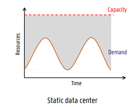
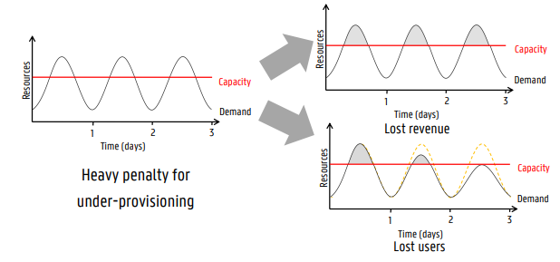
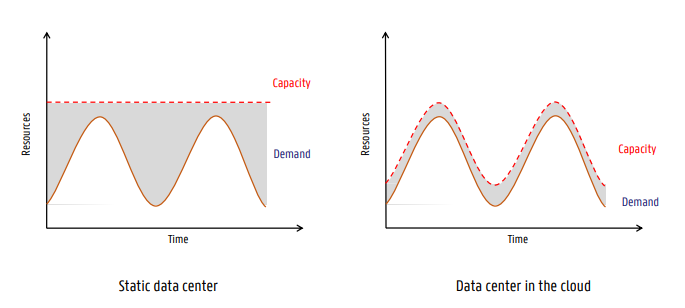
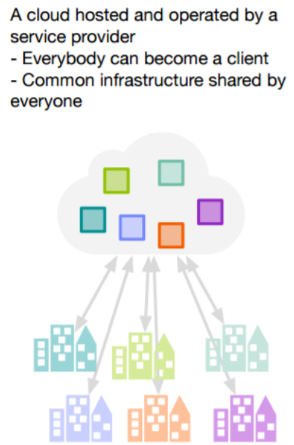
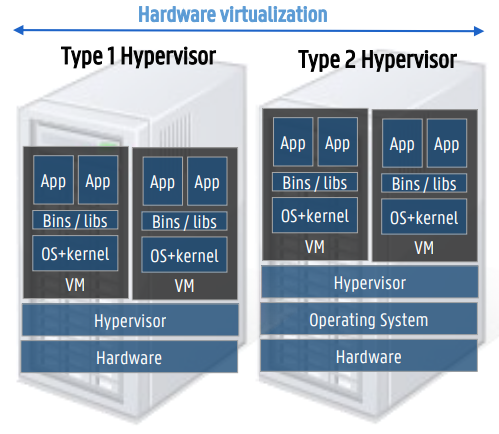

# Systeembeheer

## Course specifications

* Final grade calculation 
  * 50% on exam 
  * 50% on end-result labs 
* Individual scores (exam / labs) minimally 9/20 
  * Otherwise score maximum 9/20

* Final competences 
  * Being able to configure Windows Server systems and manage them by means of Powershell 
  * Being able to manage and configure file systems (local / cloud) 
  * Knowledge of IaaS, PaaS, SaaS, FaaS and MaaS Cloud-concepts and advanced virtualisation techniques 
  * Being able to apply Infrastructure as Code and automation tools 
  * Being able to configure and deploy a monitoring stack for system administration

# 1 - Cloud

## Cloud

### Intro

Er zijn verschillende definities van wat cloud is, maar Bruno zegt dat je dit moet kennen (let op de kernwoorden vooral): 

Een cloud is een grote pool van gemakkelijk bruikbare en toegankelijke **gevirtualiseerde** resources zoals **hardware**, **develoment platformen** en/of **services.** Die resources kunnen dynamisch geherconfigureerd worden om een variabele load aan te kunnen **(scale)**, zodat resources zo optimaal mogelijk worden gebruikt. Deze pool van resources wordt typisch aangeboden in een **pay-per-use** model aangeboden, waarbij garanties worden aangeboden door de provider in de vorm van een op maat gemaakte **SLA** (service level agreement). Netflix heeft natuurlijk veel meer macht over de opstelling van die SLA dan een klein bedrijfje, dus zij krijgen volgens Bruno waarschijnlijk een betere deal.

Alle verschillende definities van cloud hebben deze dingen gemeen:

* Pay-per-use (geen commitment)
* Elastisch (op en neer schalen on demand)
* Self-service interface
  * Webinterface met account en creditcard
* Resources zijn abstract/gevirtualiseerd
  * Je kan typisch nooit voor een specifieke fysieke machine vragen

### Economics of cloud users

Als je zelf fysieke machines hebt kan je twee problemen hebben.

|  |  |
| ------------------------------------------------------------ | ------------------------------------------------------------ |
| Je hebt te veel resources en dus verspil je super veel.      | Je hebt te weinig resources, en in de pieken zullen er dus problemen zijn, zoals mensen die hun bestelling niet kunnen maken waardoor je geld verliest. |

Dit probleem kan opgelost worden met **pay-per-use** in de cloud. Het grote voordeel is nu dat je die overtollige resources in de dalmomenten niet moet betalen, je kan dus dynamisch schalen op basis van de belasting van je systeem. 

Door de **economy of scale** kunnen cloud providers hun services veel goedkoper aanbieden dan als je de machine zelf zou hebben, want Google en Amazon hebben deals met elektriciteitsmaatschappijen, ISPs, fabrikanten, ... Bovendien zetten ze dan hun datacenters op speciale plekken waar bijvoorbeeld de elektriciteit goedkoper is. 

Cloud is ontstaan vanuit de grote techbedrijven. Om nog meer geld te verdienen hadden ze het geweldige idee om hun al bestaande infrastructuur te verhuren wanneer deze capaciteit over had.

### Cloud myths and facts

* Myths 
  * Cloud computing will eliminate the need for IT personnel 
  * There will only be one super computer in the future 
  * Moving to the cloud automatically saves money 
  * The cloud is not safe for storing data 
    * Je moet niet denken dat je beter bent in beveiliging dan Microsoft of Google
  * Transitioning to the cloud is quick and easy 
    * Altijd gedoe
* Facts 
  * Cloud technology is here to stay 
  * Cloud technology should not be ignored

### Off-premise cloud

Als je zelf in je bedrijf een cloud maakt noem je het een **on-premise cloud**. Als je dat niet doet heb je een **off-premise cloud**, typisch met de volgende eigenschappen:

* Off-premise
  * Service in een andere locatie gehost (bij provider)
  * Over het publieke internet (bij public cloud)
  * Processing gebeurt buiten de firewall van het bedrijf
* Elasticiteit
  * Schaalbaarheid van provider
  * Snel omhoog en omlaag schalen
* Flexibele billing
  * Betaling is een abonnement of op basis van verbruik 
  * Cost effective
* Virtualisatie
  * Kost optimalisatie door **multi-tenant** systemen (meerdere klanten op één fysieke machine)
* Betaalbare resources
  * Geen vaste aankopen
  * Schaal van providers
* On-demand self-service
  * Vraag een service wanneer je hem nodig hebt, deze wordt dan op vraag voorzien

### Cloud deployment models

Bruno toont on **drie** soorten clouds.

| Public cloud                                                 | Community cloud                                              | Private cloud                                                |
| ------------------------------------------------------------ | ------------------------------------------------------------ | ------------------------------------------------------------ |
|  |  |  |
| - Google, Microsoft, ...  - Voor toegang tot openbare systemen of services - Gratis of pay-per-use | - Typisch voor speciale security constraints - Bijvoorbeeld zodat de NSA niet kan meekijken  - | - We emuleren een public cloud op onze eigen resources - Je doet niet alleen voor security een private cloud - Vooral als je zeker niet wilt dat je data bij google ofzo zit  - (als je een bank bent bijvoorbeeld) - Is soms nodig om te voldoen aan reguleringen - Optie om naar public cloud te schalen (cloudburst) |

### Hybrid cloud

Wat als we nu **public cloud** en **private cloud** combineren? Dan krijg je **hybrid cloud**. De kritieke activiteiten zitten dan in de private cloud en de niet-kritieke in de public cloud. Dan kunnen we ook doen aan **cloud bursting**, dan vragen we wanneer nodig extra resources aan uit de publieke cloud, en doen we ze weer weg wanneer ze niet meer nodig zijn. 

Dan heb je ook nog **multi-cloud**, dan gebruik je clouds van verschillende providers. Dit wordt in heel veel bedrijven gedaan.

### Cloud models

## Infrastructure-as-a-service

Bij IAAS worden gebruikers voorzien van fysieke of virtuele computatie-, storage- en netwerkresources. 

Er zijn enkele verschillende soorten **offerings**:

* Closed IAAS
  * Amazon, Azure, Google, ...
* Container-as-a-service offerings
* Open IAAS
  * OpenStack

Een belangrijk begrip in dit hoofdstuk is **multi-tenacy**. Een fysieke computer wordt gedeeld door meerdere gebruikers. Hoe wordt dit mogelijk gemaakt?

* Door middel van **abstractie**
  * We maken een abstract model van hoe een generische resource eruit zou moeten zien (processor, memory, ...)
* Door **virtualisatie** is er geen afhankelijkheid op fysieke resources. 
  * Services zijn meestal gebaseerd rond virtuele machines
* Abstractielaag zorgt soms wel voor verlaagde **performance**

### Virtualisatie

|  |  |
| ------------------------------------------------------------ | ------------------------------------------------------------ |

Voor virtuele machines in de cloud wordt typisch generische hardware gebruikt. Daarboven zit dan een virtualisatielaag waarboven er virtuele hardware wordt gesimuleerd. Hier zijn een aantal voordelen van virtualisatie:

* <u>VM Isolatie</u> 
  * Secure multiplexing
    * Op een veilige manier meerdere gebruikers/applicaties op dezelfde hardware zetten zonder dat ze kunnen interfereren
    * Moderne processoren hebben betere ondersteuning voor virtualisatie, bv. direct memory access
  * Sterke garanties
    * Bug, crashes, virussen in één VM raken niet bij andere VMs (behalve als er bugs in de VM software zitten)
  * Performatie isolatie
    * Resources van het systeem partitioneren. Je kan bijvoorbeeld niet over de limiet gaan van de VM, ook al heeft de fysieke machine meer geheugen
* <u>Mixed OS environment</u>
  * Je kan meerdere besturingssystemen op één machine draaien
* <u>VM encapsulatie</u>
  * We kunnen een VM in een bestand stoppen en bijvoorbeeld doorsturen, met de volledige toestand van het geheugen, applicaties en data.
  * Dan kunnen we de VM gemakkelijk ergens anders opstarten
* <u>VM Compatibiliteit</u>
  * Oude legacy applicaties kunnen uitgevoerd worden op VMs
  * Hardwareonafhankelijk
  * Create once, run everywhere

### Virtual machine use cases

* Legacy applicaties draaien
* Software testing, met een 'clean' install van OS en software
  * Kan je het ook snel op verschillende besturingssystemen testen
* Malware testing
  * Loslaten in een gecontroleerd systeem
* Test en development
  * Snel test, development en operational servers opdraaien
* Business continuiteit
  * Snel uitrollen op meerdere servers
* Enterprise desktop
  * Beveiligen van unmanaged PCs zonder de autonomie van eindgebruikers op te offeren door een security policy rond desktop virtual machines
* Server consolidatie
  * Kosten reduceren door services op zo weinig mogelijk machines te draaien
  * Dus meerdere dingen op één machine (consolidatie)

### Evolutie

De virtualisatie zoals we hem nu kennen is natuurlijk niet in één keer tot stand gekomen. Er zijn meerdere evoluties gebeurd doorheen de jaren.

* <u>Eerste generatie</u>
  *  
  * Full virtualization, de software bootst een volledige fysieke hardware na
  * Volledig software-based, je hoeft **niets** te **wijzigen** in het **guest operating system**
  * De hardware had geen notie van virtualisatie
  * Het abstracte model van de virtuele machines werd vertaald naar de hardware (binary rewriting)
  * Grootste **nadeel** is **performantie** (25-75% tragere memory access, ...)
* <u>Tweede generatie</u>
  *  
  * Paravirtualization
  * In de VM (guest operating system) een aantal aanpassingen zodat we toch rechtstreeks naar de hardware kunnen.
  * Het **nadeel** is dat de **guest OS aangepast moest worden** afhankelijk van de gebruikte hypervisor (spreekt het nut van VMs rechtstreeks tegen)
    * Bijvoorbeeld als je VMwareTools installeert zodat je VM minder delay heeft voor de muisinput
  * Het **voordeel** is dat het **sneller** is dan de vorige generatie
* <u>Derde generatie</u>
  * Hardware-assisted virtualization: **hardware weet dat virtualisatie bestaat**
  * Guest OS moet **niet aangepast** worden
  * Je hebt wel twee dingen nodig
    * Een **hypervisor** die **hardware acceleratie ondersteunt**
    * **Processoren** die **hardware acceleratie ondersteunen**
  * Hypervisor heeft rechtstreekse access tot RAM, netwerk, storage, ...
  * Het **voordeel** is dat je een **ongewijzigde OS** kan draaien zonder problemen aan hoge performantie, maar je moet wel software hebben die dat ondersteunt.
  * Het **nadeel** is de **startup time** van de VM, want deze moet helemaal opstarten zoals een gewone PC. Dit probleem heb je eigenlijk met alle VMs.
    * Bij een container heb je dit probleem niet want deze heeft al deze rommel niet volgens Bruno
    * Bij een site zoals Zalando is deze vertraging geen probleem, maar bij Ticketmaster, waar het plots kan dat er duizenden mensen tegelijk refreshen is dit wel erg.

### OS-level virtualization

Er is ook een vierde aanpak van virtualisatie. OS-level virtualisatie wordt op het niveau van het besturingssysteem gedaan. Dit wordt vaak gebruikt voor **containers**. Het voornaamste voordeel hiervan is **densiteit**, want containers hebben niet alle extra bagage die bij een VM zit (zoals een OS en bios). Ze nemen dus veel **minder plaats** in. 

Je kan als je containers gebruikt met dezelfde hardware drie keer meer servers opstarten als wanneer je VMs gebruikt. Dit werd vooral gebruikt in de hosting markt.

#### OS-level vertualization vs VM-based virtualization

|  |  |
| ------------------------------------------------------------ | ------------------------------------------------------------ |
| - Virtuele machines zijn volledig geïsoleerd  - Elke VM heeft zijn eigen OS - De hypervisor regelt toegang tot de gedeelde hardware | - De kernel van de host heeft meerdere process spaces - Containers zijn **lightweight**, ze delen de kernel van de host OS - Elke container heeft wel zijn eigen root file system |

Je ziet dat in de afbeelding rechts er geen kernel en operating system in de container hoeven te zitten. Dan hoeft deze niet opgestart te worden. Containers zijn wel potentiëel minder veilig, want als er een exploit zit in het onderliggende besturingssysteem, zou het kunnen dat we vanuit één container toegang krijgen tot de andere. Bij een type 1 hypervisor heb je dit probleem niet, want de VMs zijn door hardware van elkaar gescheiden.

### Containers

Containers **delen dezelfde OS/kernel** en zijn veel **lichter** dan virtualisatie met een hypervisor. Ze kunnen met de host communiceren via standaard system calls. Bovendien is elke container **logisch onafhankelijk** van de andere containers en moet hij maar een kleine hoeveelheid data (applicatiedata) bijhouden. Een container kan ook op **pauze** gezet worden en op een andere machine verdergezet worden.

De voordelen van containers zijn:

* Snellere start-up tijd
* Density
  * Je kan op één fysieke host veel meer containers draaien dan VMs, want containers hebben slechts één OS per fysiek systeem nodig hebben.
* Potentieel beter management
  * Want de gedeelde kernel heeft een beter zicht op het resource gebruik van alle containers 
  * Bij hypervisors moet je allerlei trucjes gebruiken om ze goed te beheren
* Meer containers = meer winst

### Overzicht

*"De kans dat dit wordt gevraagd op het examen is zeer groot" - Bruno*

| Hypervisor                                                   | Container                                                    |
| ------------------------------------------------------------ | ------------------------------------------------------------ |
| One real hardware, many virtual hardwares, many OSs          | One real hardware, no virtual hardware, one kernel, many user space application instances. Hardware acceleratie is dus moeilijker |
| High versatility, can run different OSs                      | Hier kan je bijvoorbeeld geen DOS appllicatie mee draaien    |
| Lower density                                                | Higher density                                               |
| Virtualization/emulation overhead (derde generatie wel wat minder) | Near-native performance, almost no overhead                  |
| Hardware-enforced isolation                                  | Software-enforced isolation (minder veilig)                  |
| Size: potentially large (OS in VM)                           | Size: potentially small                                      |
| Boot time: relatively high                                   | Boot time: fast                                              |

Bij moderne technologie is de lijn tussen VM-virtualisatie en containervirtualisatie wat vager. Er zijn ook VMs met minimal OS layers, of containers die een minimal OS layer hebben. Er zijn ook containers met hardware-enforced isolation (microVM).

### Open IAAS offerings

#### Openstack

Openstack is een softwareplatform dat je toelaat om zelf een IAAS platform op te zetten, zelfs op hardware die je huurt van grote providers. Typisch doe je het wel op je eigen cloud. 

* Openstack is het meest gebruikte IAAS open source IAAS framework.
* Openstack is wel heel uitgebreid en ingewikkeld.

<small>00:18:00</small>

#### Apache Cloudstack

* Tweede meest gebruikte open-source IAAS
* Veel minder uitgebreid dan openstack, maar wel makkelijker te installeren
* API compatibel met AWS voor oganisaties die een hybrid cloud willen

#### Opennebula

* Veel minder uitgebreid dan openstack, maar wel makkelijker te installeren
* Gebruikt door sommige hele grote bedrijven (Akamai, booking.com)
* Er zit een beetje minder drive achter dan bij de andere oplossingen
* Bruno zegt dat hij er niet voor zou kiezen
* Heeft veel geld opgeslokt

#### Eucalyptus

* Niet veel bedrijven gebruiken het, laatste release in 2018
* Het is eigenlijk dood
* Focus op een AWS compatibele private en hybrid cloud

### IAAS cloud standardisation

Er zijn een aantal standaarden om ervoor te zorgen dat je van één provider over kan naar een andere:

* <u>Open virtualization format (OVF)</u>
  * Beschrijft een manier om een virtuele machine in een bestand te steken
    * Bevat OVF descriptor: XML die de ingepakte VM beschrijft (naam, requirements, ...)
    * Disk images
    * Certificaten en licenties
  * Dan kan je je VM gewoon naar ergens anders verplaatsen
* <u>Open cloud computing interface (OCCI)</u>
  *  (figuur kennen)
  * Vermijdt het gebruik van proprietaire IAAS APIs
  * Dan zijn de commando's om VMs te starten en te stoppen overal hetzelfde
  * Werkt met een RESTful protocol voor deployment, automatisch schalen, monitoring, network en storage resources.
  * Ondersteund door OpenStack, OpenNebula, Cloudstack, Amazon AWS
  * Niet ondersteund door Azure en Google Cloud, daarom is de standaard waarschijnlijk gestorven. De laatste versie was in 2015
* <u>Cloud infrastructure management interface (CIMI)</u>
  * Net hetzelfde als OCCI
  * Laatste versie in 2016
  * Er is alleen een implementatie voor Openstack, dus het heeft niet zo veel nut.
* <u>Cloud data management interface (CDMI)</u>
  * Voornamelijk bedoeld om storage to koppelen aan draaiende VMs
  * RESTful standaard voor storage, gebruikers exporteren, data tussen cloud systemen verplaatsen, ...
  * Laatste versie in 2014

Zowel OCCI en CIMI zijn weinig gebruikt, de standaard is nu Amazon EC2 (elastic cloud). Het is eigenlijk geen standaard want het is van Amazon, maar iedereen gebruikt het. EC2 heeft een REST API en een hele boel SDKs voor verschillende programmeertalen.

Azure en Google Cloud voorzien gelijkaardige applicaties.

#### Multi-cloud development

Een multi-cloud development library voorziet een API die abstractie maakt van de vershillen tussen verschillende cloud-providers. Er zijn een aantal implementaties:

* Apache libcloud
  * Open-source python toolkit om te interageren met verschillende cloud providers via één API
  * De API houdt zich bezig met compute, storage, load balancing, DNS, container virtualisatie
  * Wordt wel nog actief ontwikkeld
  * Je moet maar één keer code schrijven en kan dan kiezen welke cloud driver je gebruikt
  * Dan is het gemakkelijk om te switchen tussen cloud providers
* Apache Jclouds
  * Iets minder populair dan de python versie, maar zelfde principe
* Andere
  * Pkgcloud
    * Node.js library
  * Libretto
    * Golang

#### Open containers initiative (OCI)

OCI heeft hetzelfde doel als de standaarden die we hierboven hebben besproken, maar dan op containers. Er zijn twee manieren waarop dit wordt gedaan:

* Runtime specification (runtime-spec)
  * Een API die standaardiseert hoe we de containers starten, stoppen, pauzeren, ...
* Image specification (image-spec)
  * Zoals OVF, maar dan voor containers
  * Vertelt hoe je een container in een file steekt

#### Container networking interface (CNI)

CNI voorziet een interface tussen de container runtime in de netwerkimplementatie. CNI voorziet ook third-party plugins voor moeilijkere oplossingen. Het is een standaard die beschrijft hoe containers een IP-adres krijgen, hoe ze bereikbaar zijn, hoe ze aan routering doen, ... CNI wordt onder andere door Kubernetes gebruikt.

## Platform-as-a-service (PAAS)

We nemen de afbeelding van daarstraks er weer bij:

Bij PAAS moet je je geen zorgen meer maken om de runtime, middleware en OS, zoals bij VMs. Je moet je enkel bezighouden met de applicatie en zijn data. Het zijn vooral web-based applicaties die je toelaten om snel een applicatie te bouwen. Typisch krijg je een soort drag-and-drop interface om applicaties aan elkaar te plakken. 

Een aantal voorbeelden zijn:

* Google App engine
* Aws elastic beanstalk
* Microsoft Azure web apps
* Salesforce

Er zijn ook open-source alternatieven:

* RedHat Openshift
* Cloud foundry
* Dokku
* Flynn

### Red hat openshift

Openshift is meer een soort managed kubernetes. Dit is nuttig als je kubernetes wilt gebruiken, maar het zelf niet wilt onderhouden. Openshift heeft ook een aantal extra dingen zoals:

* Geïntegreerde CI/CD pipelines
* Applicaties kunnen in verschillende talen geschreven worden
* Kan op verschillende cloud providers gehost worden
* Ondersteuning voor private cloud
* Een marketplace voor container images

De voordelen zijn:

* Open-source distributie van kubernetes
  * Dev-ops tools bovenop kubernetes
* Portability: volgt OCI standaarden 
* Gecentraliseerd platform voor zowel on-premise als hybrid in de public cloud
* Health management via web interface
* Mature en gemakkelijk te gebruiken web UI

Nadelen

* Vreselijk duur
* Opinionated kubernetes
  * Je kan sommige dingen niet doen
  * Er zijn dingen toegevoegd die eigenlijk niet in kubernetes zitten

### Kubernetes vs openshift

| Parameter                 | Kubernetes                                                   | Openshift                                                    |
| ------------------------- | ------------------------------------------------------------ | ------------------------------------------------------------ |
| Origin                    | Open-source project/framework, geen product                  | Product met veel variaties. OpenShift Origin is open source, maar dit is eigenlijk niet de beste versie. |
| Installation              | Kan op bijna elke linux distro geïnstalleerd worden          | Gelimiteerd, voornamelijk Red Hat enterprise linux (RHEL)    |
| Key Cloud Platforms       | GKE op Google cloud, EKS op amazon AWS en AKS op Microsoft azure. | Red hat ondersteunt AWS en Azure                             |
| Security & Authentication | Well defined, maar niet zo strict als openshift. Je moet nog veel zelf doen om het veilig te krijgen. | Strictere security policies en authenticatiemodellen         |
| Use of templates          | Kubernetes Helm templates zijn flexibel en makkelijk te gebruiken | Openshift templates zijn minder gebruiksvriendelijk en flexibel |
| Releases                  | 4/jaar                                                       | 3/jaar                                                       |
| CI/CD                     | Mogelijk met Jenkins maar niet geïntegreerd in kubernetes    | Geïntegreerd met Jenkins                                     |
| Learning curve            | Geen gemakkijke web UI                                       | Gebruiksvriendelijke web console                             |
| Initial rollout           | Moeilijk als nieuwe onderdelen moeten geïnstalleerd worden (bv. dashboard) | All-in-one oplossing                                         |

### Cloud foundry

* Cloud foundry is ontwikkeld door VMware in 2011 (dus voor kubernetes)
* Orchestreert applicaties. Je kan een applicatie bouwen en cloud foundry houdt zich bezig met de rest.
* Apps draaien op **Diego Cells**
  * Gelijkaardig aan een container
  * Die Diego Cells werden dan eigenlijk op VMs geïnstalleerd
  * Later hebben ze Diego Cells vervangen door een eigen kubernetes versie (KubeCF). 
* Voordelen
  * Open source
  * Portability: makkelijk switchen tussen providers. CF voorziet de middleware tussen je applicatie en de IAAS provider.
  * Autoscaling: automatisch omhoog en omlaag scalen op basis van load
  * Gecentraliseerd platform administratie en logging
  * Applicatie health management
  * Ondersteuning voor verschillende SaaS providers (AWS, Azure, OpenStack, Google Cloud, ...)

Cloud foundry was op papier een hele goede optie, maar als je plots moet overschakelen op kubernetes zal je applicatie nooit zo goed werken als wanneer je van het begin kubernetes had gebruikt.

### Cloud foundry vs openshift

| Parameter                      | Cloud Foundry                                                | OpenShift                                                    |
| ------------------------------ | ------------------------------------------------------------ | ------------------------------------------------------------ |
| Container orchestratie         | Eerst Diego, nu kubernetes                                   | Had van in het begin kubernetes                              |
| Infrastructuur                 | Draait liefst op VMware Origin, maar kan ook op bare metal   | Kan draaien op RHEL of bare metal                            |
| Minimal deveoper version       | CF Dev                                                       | Minishift of Code-ready containers                           |
| Service registry and discovery | Consul en Eureka                                             | Eigen tooling en multicast                                   |
| Zero downtime deployments      | Blue-green deployments: twee identieke versies draaien in productie. Updates overschrijven de productie versie die offline is, waarna de load naar deze machine wordt gestuurd | Gebruikt kubernetes zero downtime deployments                |
| Build mechanism                | Buildpacks: je geeft je source code en er wordt vanzelf een container van gemaakt en gedeployed. Je bent afhankelijk van welke buildpacks er beschikbaar zijn. | Source to image conversion van source code van git repo naar docker images, waardoor ontwikkelaars zich niet moeten bezighouden met dockerfiles enzo. |

Bruno zegt dat je best dat cloud foundry gaat uitfaseren. 

### PAAS cloud standardisation

Er zijn ook een aantal standaarden voor PAAS:

* <u>Cloud application management for platforms (CAMP)</u>
  * Ontwikkeld door Oasis
  * Een taal die de applicatieartefacten en de services die nodig zijn om ze uit te voeren en verbinden beschrijft
  * Beetje hetzelfde als OCCI voor IAAS
  * Voorziet een unificatie van management intefaces van PAAS providers d.m.v. REST calls
  * In theorie zou je dan een applicatie op verschillende PAAS platformen kunnen draaien
  * Er is een POC op openstack, maar niemand gebruikt het eigenlijk
* <u>Topology and orchestration spec for cloud apps (TOSCA)</u>
  * Zeer uitgebreide standaard
  * Een blueprint maken
    * Orchestratie van cloud services 
    * Hun relaties 
    * Hoe ze beheerd worden
  * Probleem: de standaard zegt niet "hoe". De cloud vendor kan dit zelf beslissen.
  * Implementaties
    * Tosca-parser voor OpenStack
    * OpenTosca
    * Cloudify
  * Initeel geen industriële uptake
    * Maar plots heeft Red Hat de Tosca v2 diss track gedropt
    * Is nog in ontwikkeling

#### Cloudify

* Gebruikt Tosca
* Composer voor het maken van visuele Tosca blueprints
  * Je zou dan in theorie met je blueprint naar een grote cloud provider kunnen gaan en hem vertellen om je applicatie uit te voeren.
* Wordt gebruikt in het network function virtualization (NFV) domein. 
* High profile klanten
  * Intel, VMware, Atos, KPN, ...

//TODO misschien wat meer uitbreiden

## Software-as-a-service (SAAS)

Dit zijn applicaties zoals, office 365, Dropbox, Google Apps, ... Hier zijn er niet echt standaarden om je te beschermen tegen vendor lock-in. Er zijn een aantal dingen waarmee je best rekening houdt:

* Zorg dat UIs, APIs, protocollen en dataformaten goed gedefineerd zijn
* Wanneer mogelijk, vraag om gestandaardiseerde APIs, protocols en dataformaten
  * Moeilijk bij hele grote speler als Google natuurlijk
* Kan je een versie van hun software on-premise draaien?
* Is de SaaS oplossing open-source?
* Een plan voor wanneer de SaaS niet meer beschikbaar is
* Je moet ook zien dat je je data eruit kan krijgen
  * Bijvoorbeeld als een open standaard
* Of dat je je data bij hun kan verwijderen

## Function-as-a-service (FAAS)

FAAS is eigenlijk een andere naam voor serverless computing. Dan kan je je code uitvoeren zonder dat je servers moet gaan managen. 

* Serverless computing
  * Typisch kleine code fragmenten snel laten uitvoeren zonder dat je servers moet voorzien. Dan betaal je alleen voor de resources die je gebruikt hebt
  * De cloud provider beheert dan dynamisch de toewijzing van resources
  * Voorbeelden
    * AWS Lambda
    * Azure functions
    * Google cloud functions
    * Cloud foundry application runtime
  * Nadelen
    * Vendor lock-in
      * Geforceerde API upgrades
      * Verhoogde kosten
      * Veranderende limieten
    * Geen FAAS standaarden om vendor lock-in te vermijden
    * Weinig tools voor debugging en monitoring
      * Hangt af van de vendor
    * Architecturale complexiteit
      * Moeilijk om te beslissen wat serverless moet zijn
      * Hoeveel moet een functie doen
    * Je kan vendor lock-in deels vermijden. Kubernetes heeft sommige extensies waarmee je serverless computing kan doen

## Metal-as-a-service (MAAS)

* Software die ervoor zorgt dat je fysieke machines in gebruik kan nemen.
* Dit doe je typisch wanneer je geen performantieoverhead van VMs wilt. 
* MAAS zorgt dan voor de reservatie van de machine en voorziet een platform voor management, installatie, ...
* Dit is bijvoorbeeld nuttig voor performantiemetingen

# 2 - Powershell

//TODO

# Examenvragen

## Voorbeeldvragen

Voorbeeldexamenvragen van Bruno:

* What three types of storage virtualization exist? What are their main properties? What benefits and drawbacks do they offer?
* What advantages do network-based methods for storage virtualization offer compared to array-based methods?
* What three types of network-based storage virtualization exist? What are their main properties?
* What is hyperconvergence? Discuss how this can be enabled based on one specific technology that was discussed in this class.

## Van de les

Elke keer dat Bruno zegt dat je iets moet kennen voor het examen:

> Wat wordt bedoeld met Cloud. Leg uit. (Cloud slide 3)

> Geef de voordelen van virtualisatie.  (Cloud slides 56-59)

> Hoe is virtualisatie geëvolueerd doorheen de jaren? Leg de verschillende stappen uit en bespreek de veranderingen. Teken de figuurtjes. (Cloud slide 61)

> Wat is de vierde vorm van virtualisatie? (Cloud slide 68)

> Leg het verschil uit tussen VM-based virtualisatie en OS-level virtualisatie. Maak een tekening. (Cloud slide 69)

> Geef de open IAAS oplossingen en beschrijf ze. (Cloud slide 76)

Openstack is de belangrijkste, maar zeer complex

> Welke standaarden zijn er voor virtualisatie? Geef volledige namen (Cloud slide 86)

> Vergelijk kubernetes met openshift.

## Van mij

> Geef een aantal voorbeelden van cloud services.

* Online data storage/retrieval
* Enable access to online applications
  * Gmail, google slides, ...
* Provide computing platform and computing infrastructure

> Is IT-as-a-service een nieuw concept?

Nee, vanaf de jaren 30 (voor computers) verhuurt IBM al hun elektrische accounting machines aan bedrijven om berekeningen te maken. In de 70s was er timesharing en in de 90s was er grid computing. 

Ik denk dat deze vraag nogal nutteloos is maak ja ik ga hem nu niet verwijderen.

> Welke verschillende cloud models zijn er en wat houden ze in? (cloud slide 46, 01h55)

* On premises
* Infrastructure as a service
* Platform as a service
* Software as a service

> Waarom is de performantie van een applicatie op virtuele machines typisch lager dan op fysieke hardware?

Voor virtuele machines in de cloud wordt typisch generische hardware gebruikt. Daarboven zit dan een abstractielaag waarboven er virtuele hardware wordt gesimuleerd.

> Wat zijn de voordelen van containers?